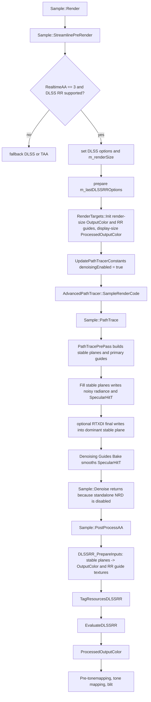

# DLSS_RR

## Overview
`DLSS_RR` 是 RTXPT 实时路径追踪的 Streamline/DLSS Ray Reconstruction 降噪与超分路径。它不通过 `Sample::Denoise` 的 NRD `NrdIntegration` per-plane denoiser，而是在 `PathTrace` 生成 stable-plane radiance 与 denoising guides 后，由 `Sample::PostProcessAA` 准备 DLSS RR 输入纹理并调用 Streamline `EvaluateDLSSRR` 输出到 `ProcessedOutputColor`。

## Responsibilities
- 在 `RealtimeAA == 3` 且 Streamline/DLSS RR 可用时，作为实时模式的 AA/SR/denoising 路径；不可用时在 `StreamlinePreRender` 中降级到 DLSS 或 TAA。
- 通过 `UpdatePathTracerConstants` 打开 path tracer 的 denoising/stable-plane 数据路径，并设置 DLSS RR 相关 jitter、LOD bias 与 brightness clamp。
- 使用 stable planes、stable radiance、noisy radiance、depth、motion vectors、specular hit distance 和 BSDF estimates 生成 DLSS RR 所需的 input color、diffuse/spec albedo、normal+roughness、specular motion vectors。
- 将准备好的资源通过 Donut `StreamlineInterface::TagResourcesDLSSRR` 标记为 DLSS RR 输入/输出，并调用 `StreamlineInterface::EvaluateDLSSRR` 执行外部插件。
- 把 DLSS RR 输出写入 display-size `ProcessedOutputColor`，供后续 bloom、tone mapping 和最终 blit 使用。

## Involved Files & Symbols
- `Rtxpt/Sample.cpp` - `Sample::Sample`, `Sample::StreamlinePreRender`, `Sample::UpdatePathTracerConstants`, `Sample::Render`, `Sample::PathTrace`, `Sample::PostProcessAA`, `Sample::ComputeCameraJitter`, `Sample::RecreateBindingSet`
- `Rtxpt/Sample.h` - `Sample::m_lastDLSSRROptions`, `Sample::m_renderSize`, `Sample::m_displaySize`
- `Rtxpt/AdvancedSample.cpp` - `AdvancedPathTracer::SampleRenderCode`
- `Rtxpt/SampleUI.h` / `Rtxpt/SampleUI.cpp` - `SampleUIData::RealtimeAA`, `IsDLSSRRSupported`, `DLSRRPreset`, `DLSSRRMicroJitter`, `DLSSRRBrightnessClampK`, `DisableReSTIRsWithDLSSRR`, `ActualUseStandaloneDenoiser`, `ActualUseReSTIRDI`, `ActualUseReSTIRGI`
- `Rtxpt/SampleCommon/CommandLine.h` / `Rtxpt/SampleCommon/CommandLine.cpp` - default `RealtimeAA = 3`, `--realtimeAA`, `--standaloneDenoiser`
- `Rtxpt/SampleCommon/RenderTargets.h` / `Rtxpt/SampleCommon/RenderTargets.cpp` - `OutputColor`, `ProcessedOutputColor`, `RRDiffuseAlbedo`, `RRSpecAlbedo`, `RRNormalsAndRoughness`, `RRSpecMotionVectors`, `RRTransparencyLayer`, `SpecularHitT`, stable-plane resources
- `Rtxpt/ProcessingPasses/PostProcess.h` / `Rtxpt/ProcessingPasses/PostProcess.cpp` - `PostProcess::ComputePassType::DLSSRRDenoiserPrepareInputs`, `PostProcess::PostProcess`, `PostProcess::Apply`
- `Rtxpt/ProcessingPasses/PostProcess.hlsl` - `DENOISER_PREPARE_INPUTS` + `DENOISER_DLSS_RR` shader path, `ComputeSpecularMotionVector`
- `Rtxpt/ProcessingPasses/DenoisingGuidesBaker.cpp` / `.hlsl` - `DenoisingGuidesBaker::DenoiseSpecHitT`, `ComputeAvgLayerRadiance`
- `Rtxpt/Shaders/Bindings/ShaderResourceBindings.hlsli` - `u_RRDiffuseAlbedo`, `u_RRSpecAlbedo`, `u_RRNormalsAndRoughness`, `u_RRSpecMotionVectors`, `u_DenoisingAvgLayerRadiance`, `u_OutputColor`, `u_MotionVectors`, `u_Depth`, `u_SpecularHitT`
- `Rtxpt/Shaders/PathTracer/PathTracerShared.h` - `PathTracerConstants::denoisingEnabled`, `perPixelJitterAAScale`, `DLSSRRBrightnessClampK`
- `Rtxpt/RTXDI/DIFinalShading.hlsl`, `GIFinalShading.hlsl`, `FusedDIGIFinalShading.hlsl` - ReSTIR final contribution routing when `denoisingEnabled`
- `External/Donut/include/donut/app/StreamlineInterface.h` - `DLSSRROptions`, `TagResourcesDLSSRR`, `EvaluateDLSSRR`
- `External/Donut/src/app/streamline/StreamlineIntegration.cpp` - `SetDLSSRROptions`, `TagResourcesDLSSRR`, `EvaluateDLSSRR`

## Architecture
`Sample::Render` 每帧先把 display size 写入 `m_displaySize/m_renderSize`，随后调用 `StreamlinePreRender`。当 `RealtimeAA == 3` 时，`StreamlinePreRender` 先检查 `IsDLSSRRSupported`，不可用则把 mode 降级到 DLSS；然后设置普通 DLSS options、查询 optimal render size，并把 `m_renderSize` 改为 DLSS 推荐的内部渲染分辨率。随后构造 `DLSSRROptions`，继承 DLSS mode/output/preExposure/HDR 等参数，设置 `normalRoughnessMode = ePacked`、`alphaUpscalingEnabled = false`、`preset = m_ui.DLSRRPreset`，暂存到 `m_lastDLSSRROptions`。

render target 重建发生在 `StreamlinePreRender` 之后，因此 DLSS RR 模式下 `OutputColor` 和 RR guide textures 使用 render-size，`ProcessedOutputColor` 使用 display-size。`RenderTargets::Init` 为 DLSS RR 创建独立 `RRDiffuseAlbedo`、`RRSpecAlbedo`、`RRNormalsAndRoughness` 和 `RRSpecMotionVectors`；`RRTransparencyLayer` 当前没有创建，CPU binding slot 74 会退回绑定 `RRSpecMotionVectors`。

`UpdatePathTracerConstants` 对 DLSS RR 有三处关键影响：`perPixelJitterAAScale` 在实时 RR 模式下取 `m_ui.DLSSRRMicroJitter`，`texLODBias` 叠加 render/display 分辨率比计算出的 DLSS bias，`denoisingEnabled` 在 standalone NRD 或 `RealtimeAA == 3` 时为 true。同时 `DLSSRRBrightnessClampK` 会乘以当前 pre-exposed gray luminance 后传给 shader。

路径追踪仍由 `AdvancedPathTracer::SampleRenderCode` 编排：可选 `RtxdiPass::BeginFrame`，然后 `PathTrace(framebuffer, constants)`，再调用 `Denoise(framebuffer)`。在 DLSS RR 模式下 `SampleUIData::ActualUseStandaloneDenoiser()` 返回 false，因此 `Sample::Denoise` 不运行 NRD；真正的降噪发生在后续 `Sample::PostProcessAA` 的 DLSS RR 分支。

`Sample::PathTrace` 在 realtime mode 下先执行 `PathTracePrePass` 构建 stable planes，并写出 `Depth`、`ScreenMotionVectors`、`Throughput`、初始化 `SpecularHitT`。随后主 `PathTrace` 使用 `PATH_TRACER_MODE_FILL_STABLE_PLANES`，把 unstable/noisy radiance 写入各 stable plane 的 `PackedNoisyRadianceAndSpecAvg`，并导出 specular hit distance。若 ReSTIR DI/GI 被启用且 `denoisingEnabled` 为 true，final shading 会把贡献加到 dominant stable plane 的 noisy radiance，而不是直接写 `OutputColor`。`Denoising Guides Bake` 随后平滑 `SpecularHitT`，但 `ComputeAvgLayerRadiance` 的有效 shader 逻辑目前基本处于 disabled 状态。

`Sample::PostProcessAA` 是 DLSS RR 的实际提交点。函数每帧设置 Streamline constants，包括 camera、clip-to-prev-clip、jitter、motion vector scale、reset 等；若 `RealtimeAA == 3`，还补齐 `m_lastDLSSRROptions.worldToCameraView/cameraViewToWorld` 并调用 `SetDLSSRROptions`。随后先标记通用 Streamline 资源和 DLSS/NIS 资源，再进入 `DLSS-RR` marker。

`DLSSRR_PrepareInputs` compute pass 调用 `PostProcess::Apply(..., DLSSRRDenoiserPrepareInputs, ...)`。`PostProcess::PostProcess` 为该枚举编译 `PostProcess.hlsl`，宏为 `DENOISER_PREPARE_INPUTS=1` 与 `DENOISER_DLSS_RR=1`。shader 从 `StableRadiance` 开始累加所有有效 stable plane 的 noisy radiance，得到 DLSS RR input color 并写回 `u_OutputColor`；同时按 stable-plane throughput/权重混合 BSDF estimate、normal 与 roughness，写入 `u_RRDiffuseAlbedo`、`u_RRSpecAlbedo`、`u_RRNormalsAndRoughness`。specular motion vector 默认由 `SpecularHitT`、primary hit position/normal、reflection ray 和当前/上一帧 world-to-clip matrix 估算，写入 `u_RRSpecMotionVectors`。

当前 active C++ 路径中 `useSpecHitT` 是静态 false，注释标记 hitT 直传路径有 bug。因此 `TagResourcesDLSSRR` 传入的是 `specHitDist = nullptr`、`specMotionVectors = RRSpecMotionVectors`；roughness 也传 `nullptr`，对应 `normalRoughnessMode = ePacked`，roughness 放在 `RRNormalsAndRoughness.w`。active 调用的资源顺序是：`inputColor = OutputColor`、`diffuseAlbedo = RRDiffuseAlbedo`、`specAlbedo = RRSpecAlbedo`、`normalsAndOptionalRoughness = RRNormalsAndRoughness`、`outputColor = ProcessedOutputColor`。最后 `EvaluateDLSSRR` 调用 Streamline 的 `slEvaluateFeature(sl::kFeatureDLSS_RR)`，把结果写入 `ProcessedOutputColor`。

## Dependencies
- Internal rendering state: `Sample`, `AdvancedPathTracer`, `RenderTargets`, `PostProcess`, `DenoisingGuidesBaker`, optional `RtxdiPass`, `TemporalAntiAliasingPass` for jitter generation.
- Path tracing data contract: stable planes (`StablePlanesHeader`, `StablePlanesBuffer`, `StableRadiance`), noisy radiance, BSDF estimates, normal/roughness, `Depth`, `ScreenMotionVectors`, `SpecularHitT`.
- Streamline / DLSS RR: `DONUT_WITH_STREAMLINE`, `STREAMLINE_HAS_DLSS_RR`, `StreamlineInterface::DLSSRROptions`, `SetDLSSRROptions`, `TagResourcesGeneral`, `TagResourcesDLSSNIS`, `TagResourcesDLSSRR`, `EvaluateDLSSRR`.
- GPU resource formats: `OutputColor` and `ProcessedOutputColor` use HDR radiance format; RR albedos use `R11G11B10_FLOAT`; `RRNormalsAndRoughness` uses `RGBA16_FLOAT`; `RRSpecMotionVectors` uses `RG16_FLOAT`; `SpecularHitT` uses `R32_FLOAT`.
- UI/config: `RealtimeMode`, `RealtimeAA`, `DLSSMode`, `DLSRRPreset`, `DLSSRRMicroJitter`, `DLSSRRBrightnessClampK`, `DisableReSTIRsWithDLSSRR`, `StablePlanesActiveCount`, `DbgFreezeRealtimeNoiseSeed`, `ResetRealtimeCaches`.

## Notes
- DLSS RR 和 standalone NRD 是互斥的实际降噪路径：`RealtimeAA == 3` 会让 `ActualUseStandaloneDenoiser()` 返回 false，UI 也禁用 NRD checkbox。
- `Sample::Denoise` 仍会被 `AdvancedPathTracer::SampleRenderCode` 调用，但在 DLSS RR 模式下因 `ActualUseStandaloneDenoiser()` 为 false 直接返回。
- DLSS RR 依赖 stable-plane 数据；`UpdatePathTracerConstants` 中的 `denoisingEnabled = ActualUseStandaloneDenoiser() || RealtimeAA == 3` 是让 path tracer/RTXDI 把 radiance 留在 denoiser 可消费布局中的关键开关。
- 默认命令行 `RealtimeAA = 3`，即默认倾向 DLSS RR；但 `StreamlinePreRender` 会在不支持 DLSS RR 或 DLSS 时自动降级。
- `DisableReSTIRsWithDLSSRR` 默认 true；`ActualUseReSTIRDI/GI` 在 `RealtimeAA == 3` 时会据此关闭 ReSTIR final passes，因为当前实现标注为尚未针对 DLSS RR 调优。
- `DenoisingGuidesBaker::ComputeAvgLayerRadiance` 会 dispatch，但 shader 中有效平均 layer radiance 写入逻辑当前基本 disabled；`PostProcess.hlsl` 中 DLSS RR 对平均 layer radiance 的权重采样也在 `#if 0` 内。
- `useSpecHitT` 目前固定 false，注释说明直接使用 hit distance 的路径有 bug；当前实际传给 Streamline 的是 specular motion vectors。
- `RRTransparencyLayer` 在 `RenderTargets::Init` 中没有创建，active `TagResourcesDLSSRR` 签名也没有传 transparency layer；不要把它当作当前 DLSS RR 输入。
- `DLSSRRBrightnessClampK` 默认正值。若配置为小于等于 0，CPU 会传 0，shader 的 `maxRadiance > DLSSRRBrightnessClampK` 分支会把正 radiance 乘到 0，可能导致 DLSS RR input color 被清黑。
- Donut `TagResourcesDLSSRR` 要求 `specHitDist` 与 `specMotionVectors` 二选一，不能同时为空或同时非空；当前路径满足该约束。
- Streamline wrapper 的 `TagResourcesDLSSRR` 参数包含 render/display size，但实现实际用 input/output texture desc 构造 SL extents，因此 `OutputColor` 与 `ProcessedOutputColor` 的尺寸必须正确。

## Callers
- `Sample::Sample` 查询 `GetDeviceManager()->GetStreamline().IsDLSSRRAvailable()` 并写入 UI capability flag。
- `Sample::Render` 每帧调用 `StreamlinePreRender`、`UpdatePathTracerConstants`、`SampleRenderCode`、`PostProcessAA`，构成 DLSS RR 的 CPU 调度主链路。
- `AdvancedPathTracer::SampleRenderCode` 在 `PathTrace` 后调用 `Denoise`；DLSS RR 模式下该调用不会执行 NRD，实际 DLSS RR evaluation 位于随后由 `Sample::Render` 调用的 `PostProcessAA`。
- `SampleUI` 和 command line 通过 `RealtimeAA == 3` 选择 DLSS RR。