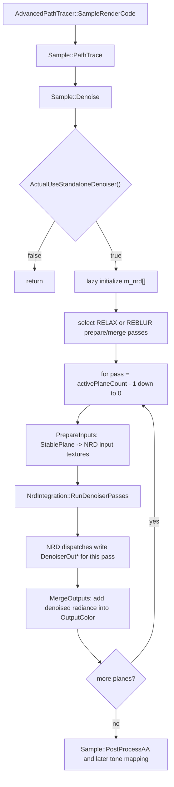

# Denoise

## Overview
`Sample::Denoise` 是高级 path tracer 在 `PathTrace` 之后执行的独立 NRD 降噪流程。它按 active stable plane 逐层把 stable-plane 数据转换为 NRD 输入，调用每个 plane 对应的 `NrdIntegration` 实例运行 RELAX 或 REBLUR，然后把降噪后的 diffuse/specular radiance 合并回 `OutputColor`。

## Responsibilities
- 在 `m_ui.ActualUseStandaloneDenoiser()` 为 false 时直接返回，只处理 realtime 且未进入 DLSS RR AA 模式的 standalone NRD 路径。
- 延迟创建 `m_nrd[cStablePlaneCount]` 中的 `NrdIntegration`，根据 `m_ui.NRDMethod` 选择 `REBLUR_DIFFUSE_SPECULAR` 或 `RELAX_DIFFUSE_SPECULAR` 并按当前 render size 初始化。
- 根据 NRD 方法选择 `PostProcess::ComputePassType`：RELAX/REBLUR 的 `DenoiserPrepareInputs` 与 `DenoiserFinalMerge`。
- 按 `StablePlanesActiveCount` 从高索引 plane 到低索引 plane 逐层执行：准备输入、运行 NRD dispatch、合并输出。
- 将 UI 中的 disocclusion threshold、alternate mix、RELAX/REBLUR settings、reset history、validation debug view 等参数传入 NRD。

## Involved Files & Symbols
- `Rtxpt/Sample.cpp` - `Sample::Denoise`, `Sample::Render`, `Sample::CreateRenderPasses`, `Sample::UpdatePathTracerConstants`, `Sample::PostProcessAA`
- `Rtxpt/Sample.h` - `Sample::m_nrd`, `Sample::Denoise`
- `Rtxpt/AdvancedSample.cpp` - `AdvancedPathTracer::SampleRenderCode`
- `Rtxpt/SampleUI.h` / `Rtxpt/SampleUI.cpp` - `SampleUI::ActualUseStandaloneDenoiser`, NRD UI parameters
- `Rtxpt/NRD/NrdIntegration.h` / `Rtxpt/NRD/NrdIntegration.cpp` - `NrdIntegration`, `NrdIntegration::RunDenoiserPasses`
- `Rtxpt/ProcessingPasses/PostProcess.h` / `Rtxpt/ProcessingPasses/PostProcess.cpp` - `PostProcess::ComputePassType`, `PostProcess::Apply`
- `Rtxpt/ProcessingPasses/PostProcess.hlsl` - `DENOISER_PREPARE_INPUTS`, `DENOISER_FINAL_MERGE`
- `Rtxpt/NRD/DenoiserNRD.hlsli` - NRD front-end UAV binding 与 pack/post-process helpers
- `Rtxpt/SampleCommon/RenderTargets.h` / `Rtxpt/SampleCommon/RenderTargets.cpp` - NRD 输入、输出与 validation render targets

## Architecture
入口位于 `AdvancedPathTracer::SampleRenderCode`：每帧先可选调用 RTXDI `BeginFrame`，再执行 `PathTrace(framebuffer, constants)`，随后调用 `Denoise(framebuffer)`。`Sample::Render` 在 `SampleRenderCode` 之后继续执行 `PostProcessAA`、pre-tonemapping、tonemapping 与后处理，因此 standalone NRD 的输出会成为 AA/tonemapping 前的输入。

`Sample::Denoise` 先检查 `ActualUseStandaloneDenoiser()`。该 UI helper 只有在 realtime mode 且 `RealtimeAA < 3` 时才返回 `StandaloneDenoiser`，所以 reference accumulation 与 DLSS RR 路径不会进入这段 NRD standalone 流程。

NRD 实例采用 lazy init。函数遍历 `m_nrd` 数组，空指针时根据当前 `m_ui.NRDMethod` 创建 `NrdIntegration(GetDevice(), denoiserMethod)` 并调用 `Initialize(m_renderSize.x, m_renderSize.y, *m_shaderFactory)`。`Sample::CreateRenderPasses` 附近会在 render target 尺寸变化、shader reload、NRD 方法切换或关闭 standalone denoiser 时清空 `m_nrd`，下一帧再按当前配置重建。

随后函数为当前方法选择 prepare/merge compute pass。`RELAX` 使用 `RELAXDenoiserPrepareInputs` 与 `RELAXDenoiserFinalMerge`；否则使用 `REBLURDenoiserPrepareInputs` 与 `REBLURDenoiserFinalMerge`。`PostProcess` 构造 shader 时会把这些枚举转成 `DENOISER_PREPARE_INPUTS` / `DENOISER_FINAL_MERGE` 和 `USE_RELAX=1/0` 宏。

核心循环使用 `maxPassCount = min(m_ui.StablePlanesActiveCount, size(m_nrd))`，并从 `maxPassCount - 1` 递减到 `0`。每个 pass 都写入 GPU marker `Denoising plane N`，构造 `SampleMiniConstants(uint4(pass, initWithStableRadiance ? 1 : 0, 0, 0))`。只有循环的第一次 dispatch 会带 `initWithStableRadiance=1`，`DENOISER_PREPARE_INPUTS` shader 因此先用 `StableRadiance` 初始化 `OutputColor`，后续 plane 只继续累加各自降噪结果。

PrepareInputs 阶段通过 `m_postProcess->Apply(m_commandList, preparePassType, m_constantBuffer, miniConstants, m_bindingSet, m_bindingLayout, width, height)` 调度 `PostProcess.hlsl`。该 shader 按当前 stable plane 读取 `StablePlanesBuffer`，为 NRD 写出 `DenoiserViewspaceZ`、`DenoiserMotionVectors`、`DenoiserNormalRoughness`、`DenoiserDiffRadianceHitDist`、`DenoiserSpecRadianceHitDist` 与 `DenoiserDisocclusionThresholdMix`。它会跳过 sky/no data 像素并写 `VIEWZ_SKY_MARKER`，对 radiance 做 BSDF demodulation、radiance clamp，并按 `USE_RELAX` 分别调用 RELAX 或 REBLUR front-end pack helper。

RunDenoiserPasses 阶段把 prepare 阶段写好的 render targets 交给 `m_nrd[pass]`。`Sample::Denoise` 传入当前/上一帧 view、`GetFrameIndex()`、disocclusion threshold、alternate threshold mix、`timeDeltaBetweenFrames`、validation flag、reset history flag，以及 `m_ui.RelaxSettings` 或 `m_ui.ReblurSettings`。windowless 渲染固定使用 `1/60` 秒以保持输出确定性；窗口模式传 `-1`，由 NRD 内部追踪 frame delta。

`NrdIntegration::RunDenoiserPasses` 会把 method-specific settings 写入 NRD，设置 `nrd::CommonSettings` 中的当前/上一帧 view/projection、camera jitter、motion vector scale、frame index、denoising range、validation、disocclusion、resource rect 与 accumulation mode。随后通过 `nrd::GetComputeDispatches` 获取 NRD dispatch 列表，逐个绑定常量、sampler、输入输出资源、transient/permanent pool texture，并执行 compute dispatch。输出写入 `DenoiserOutDiffRadianceHitDist[pass]` 与 `DenoiserOutSpecRadianceHitDist[pass]`，validation 视图可选写入 `DenoiserOutValidation`。

MergeOutputs 阶段调用 `m_postProcess->Apply(m_commandList, mergePassType, pass, m_constantBuffer, miniConstants, m_renderTargets->OutputColor, *m_renderTargets, nullptr)`。这个 overload 会绑定当前 pass 的 `DenoiserOutDiffRadianceHitDist[pass]`、`DenoiserOutSpecRadianceHitDist[pass]`、`DenoiserViewspaceZ`、`DenoiserDisocclusionThresholdMix`、`DenoiserOutValidation` 与 `StablePlanesBuffer`，并把 `OutputColor` 作为 UAV。`DENOISER_FINAL_MERGE` shader 读取降噪后的 diffuse/specular radiance，结合 stable plane 中保存的 BSDF estimate 调用 `DenoiserNRD::PostDenoiseProcess`，最后对有效 surface 像素执行 `u_InputOutput[pixel].xyz += max(0, diff + spec)`。

## Dependencies
- 内部对象：`Sample`, `AdvancedPathTracer`, `PostProcess`, `RenderTargets`, `NrdIntegration`, `SampleUI`, `PlanarView`。
- 外部库：NRD (`nrd::Denoiser`, `nrd::CommonSettings`, `nrd::GetComputeDispatches`)；NVRHI (`nvrhi::ICommandList`, textures, binding sets, compute pipelines)；Donut shader factory/common passes。
- GPU 资源：`OutputColor`, `StableRadiance`, `StablePlanesBuffer`, `DenoiserViewspaceZ`, `DenoiserMotionVectors`, `DenoiserNormalRoughness`, `DenoiserDiffRadianceHitDist`, `DenoiserSpecRadianceHitDist`, `DenoiserDisocclusionThresholdMix`, `DenoiserOutDiffRadianceHitDist[]`, `DenoiserOutSpecRadianceHitDist[]`, `DenoiserOutValidation`。
- UI/config：`RealtimeMode`, `RealtimeAA`, `StandaloneDenoiser`, `NRDMethod`, `StablePlanesActiveCount`, `ResetRealtimeCaches`, `NRDDisocclusionThreshold*`, `NRDUseAlternateDisocclusionThresholdMix`, `RelaxSettings`, `ReblurSettings`, `DebugView`。
- Shader 宏与入口：`PostProcess::ComputePassType` 经 `PostProcess.cpp` 转换为 `DENOISER_PREPARE_INPUTS`、`DENOISER_FINAL_MERGE`、`USE_RELAX`。

## Notes
- `Sample::Denoise` 的 `framebuffer` 参数当前没有实际使用，源码中 `framebuffer->getFramebufferInfo()` 也被注释掉。
- `m_nrd` 的方法类型只在创建 `NrdIntegration` 时确定；切换 RELAX/REBLUR 依赖外层 `m_ui.NRDModeChanged` 清空实例，否则旧实例不会在 `Denoise` 内自动替换。
- `passNames` 当前硬编码 4 个名字，并用 `assert(size(m_nrd) <= size(passNames))` 保护；如果未来调整 `cStablePlaneCount`，需要同步更新 marker 名称。
- 循环从高 stable plane 往低 stable plane 合并，且只在第一个 pass 初始化 `OutputColor` 为 stable radiance；改变循环方向会影响累加初始化语义。
- `resetHistory = m_ui.ResetRealtimeCaches` 会把 NRD common settings 的 accumulation mode 设为 `CLEAR_AND_RESTART`，对所有 active plane 生效。
- `enableValidation` 只有在 debug view 为 `StablePlane_DenoiserValidation` 且 `DenoiserOutValidation` texture 存在时才会真正启用；该 texture 受 debug visualization 编译开关影响。
- PrepareInputs 每个 plane 都重写同一组 direct NRD input textures，再立即调用对应 plane 的 NRD 实例；源码注释说明这是为了简化接口，代价是存在冗余 copy/packing。
- 函数没有显式检查 `NrdIntegration::Initialize` 或 `IsAvailable()` 的结果，调用路径默认 NRD 初始化成功。

## Callers
- `AdvancedPathTracer::SampleRenderCode` 在 `PathTrace(framebuffer, constants)` 后直接调用 `Denoise(framebuffer)`。
- `Sample::Render` 调用虚函数 `SampleRenderCode` 后执行 `PostProcessAA(framebuffer, needNewPasses || m_ui.ResetRealtimeCaches)`，因此 standalone NRD 输出进入后续 AA 与 tone mapping。