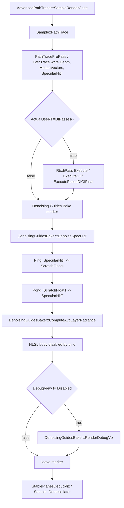

# DenoisingGuidesBake

## Overview
`Denoising Guides Bake` 是 `Sample::PathTrace` 中位于路径追踪与可选 RTXDI 之后、稳定平面调试可视化与独立 NRD 降噪之前的一组 compute pass。当前有效工作主要是对路径追踪阶段导出的 `SpecularHitT` guide 做基于深度的 ping-pong 平滑；平均 layer radiance 与 debug 可视化流程在源码中存在调度入口，但 shader 有效体目前基本为空。

## Responsibilities
- 在 GPU marker `Denoising Guides Bake` 范围内串行调度 `DenoiseSpecHitT`、`ComputeAvgLayerRadiance` 和可选 `RenderDebugViz`。
- 使用 `ScratchFloat1` 作为临时 ping-pong 缓冲，对全分辨率 `SpecularHitT` 执行两次 compute dispatch，并把结果写回 `SpecularHitT`。
- 调度 half-res `DenoiserAvgLayerRadianceHalfRes` 的平均 layer radiance pass；但 `DenoisingGuidesBaker.hlsl` 中该 pass 的实际计算代码处于 `#if 0`，当前不会写出有效平均 radiance。
- 当 `m_ui.DebugView != DebugViewType::Disabled` 时调度 `DebugViz`；但 HLSL 中当前只有 TODO 与注释掉的 debug 绘制代码，通常不会产生可见输出。

## Involved Files & Symbols
- `Rtxpt/Sample.cpp` - `Sample::CreateRenderPasses`, `Sample::RecreateBindingSet`, `Sample::PathTrace`
- `Rtxpt/AdvancedSample.cpp` - `AdvancedPathTracer::SampleRenderCode`
- `Rtxpt/ProcessingPasses/DenoisingGuidesBaker.h` - `DenoisingGuidesBaker`
- `Rtxpt/ProcessingPasses/DenoisingGuidesBaker.cpp` - `DenoisingGuidesBaker::DenoisingGuidesBaker`, `DenoisingGuidesBaker::DenoiseSpecHitT`, `DenoisingGuidesBaker::ComputeAvgLayerRadiance`, `DenoisingGuidesBaker::RenderDebugViz`
- `Rtxpt/ProcessingPasses/DenoisingGuidesBaker.hlsl` - `DenoisingGuidesBakerConstants`, `SpecHitTNeighbourhood`, `DenoiseSpecHitT`, `ComputeAvgLayerRadiance`, `DebugViz`
- `Rtxpt/SampleCommon/RenderTargets.h` / `Rtxpt/SampleCommon/RenderTargets.cpp` - `RenderTargets::SpecularHitT`, `RenderTargets::ScratchFloat1`, `RenderTargets::DenoiserAvgLayerRadianceHalfRes`
- `Rtxpt/Shaders/PathTracer/PathTracer.hlsli` - `PathFlags::exportSpecHitTQueued` 的触发与停止条件
- `Rtxpt/Shaders/PathTracerBridgeDonut.hlsli` - `Bridge::ExportSurfaceInit`, `Bridge::ExportSpecHitTStart`, `Bridge::ExportSpecHitTStop`
- `Rtxpt/Shaders/Bindings/ShaderResourceBindings.hlsli` - 全局 UAV register 中 `u_SpecularHitT`, `u_ScratchFloat1`, `u_DenoisingAvgLayerRadiance`
- `Rtxpt/shaders.cfg` - `DenoiseSpecHitT`, `ComputeAvgLayerRadiance`, `DebugViz` shader entry 注册

## Architecture
`Sample::CreateRenderPasses` 构造 `DenoisingGuidesBaker`，传入 `IDevice`、`ShaderFactory`、`RenderTargets`、`ShaderDebug` 与全局 `m_bindingLayout`。构造函数基于同一个 binding layout 创建三个 `ComputePass`，入口分别是 `DenoiseSpecHitT`、`ComputeAvgLayerRadiance` 与 `DebugViz`。`DenoisingGuidesBakerConstants` 在 C++ 中通过 `static_assert` 保证大小等于 `SampleMiniConstants`，复用全局 binding layout 的 push constants 槽位 `b1`。

路径追踪阶段先产生 guides。`Bridge::ExportSurfaceInit` 会把 `u_SpecularHitT` 初始化为 0；在 `PATH_TRACER_MODE_FILL_STABLE_PLANES` 下，`PathTracer.hlsli` 对 dominant denoising layer 上的非 diffuse/specular 路径排队导出 spec hit distance：`Bridge::ExportSpecHitTStart` 先写入负的当前 path scene length，后续遇到非 delta lobe 或超过 bounce 限制时由 `Bridge::ExportSpecHitTStop` 写回 specular hit distance。

`Denoising Guides Bake` marker 由 `RAII_SCOPE(m_commandList->beginMarker(...), m_commandList->endMarker())` 管理，因此离开 C++ 代码块时会自动结束 GPU marker。marker 内部执行顺序固定：先 `DenoiseSpecHitT`，再 `ComputeAvgLayerRadiance`，最后在 DebugView 非 Disabled 时执行 `RenderDebugViz`。

`DenoiseSpecHitT` 使用 `ceil(RenderSize / DGB_2D_THREADGROUP_SIZE)` 计算 8x8 线程组数量。当前 `static int passCount = 1`，每个 pass 包含一次 ping 和一次 pong：ping 设置 `SpecularHitT` 为 UAV，push constants 中 `Ping=1`，shader 从 `u_SpecularHitT` 读取并写入 `u_ScratchFloat1`；pong 设置 `SpecularHitT` 与 `ScratchFloat1` 为 UAV，`Ping=0`，shader 从 `u_ScratchFloat1` 读取并写回 `u_SpecularHitT`。结束时再次把 `SpecularHitT` 置为 UAV 状态，供后续通道继续使用。

`SpecHitTNeighbourhood` 是当前核心 shader 逻辑：它以当前像素为中心采样 5x5 邻域，读取 `u_Depth` 进行深度一致性筛选，忽略小于 `0.05` 的 hit T，把邻域值 clamp 到 `HLF_MAX`，只累积正值且深度接近的样本。若无有效邻居则保持原值；若中心无效则用邻域平均值补齐；若中心有效则返回 `min(prevHitT * 1.5 + 0.5, vAvg)`，避免平滑结果相对原值增长过快。

`ComputeAvgLayerRadiance` 按 `DenoiserAvgLayerRadianceHalfRes` 纹理描述获取 half-res dispatch 尺寸并执行 compute pass。需要特别注意：`DenoisingGuidesBaker.hlsl` 中真正读取 stable planes、motion vectors 并写 `u_DenoisingAvgLayerRadiance` 的代码整体在 `#if 0` 内，因此当前 active shader body 不会写入 `DenoiserAvgLayerRadianceHalfRes`。

`RenderDebugViz` 使用全分辨率 dispatch，并把当前 `DebugViewType` 写入 push constants；但 `DebugViz` shader 中实际 debug 绘制逻辑处于 TODO/注释状态，因此此路径当前主要提供 future hook，不应视为已有 debug 输出。

## Dependencies
- 内部对象：`Sample`, `AdvancedPathTracer`, `DenoisingGuidesBaker`, `RenderTargets`, `ComputePass`, `ShaderDebug`, `NrdIntegration`, `RtxdiPass`。
- NVRHI / Donut：`nvrhi::ICommandList`, `nvrhi::BindingSetHandle`, `nvrhi::BindingLayoutHandle`, `donut::engine::ShaderFactory`, `donut::engine::BindingCache`。
- GPU 资源：`Depth`/`u_Depth`, `SpecularHitT`/`u_SpecularHitT`, `ScratchFloat1`/`u_ScratchFloat1`, `DenoiserAvgLayerRadianceHalfRes`/`u_DenoisingAvgLayerRadiance`。
- Shader 配置：`Rtxpt/shaders.cfg` 中注册的 `ProcessingPasses/DenoisingGuidesBaker.hlsl` 三个 compute entry。
- CPU/GPU 契约：`DenoisingGuidesBakerConstants` 必须维持与 `SampleMiniConstants` 相同大小，以匹配全局 push constants 绑定。

## Notes
- `Denoising Guides Bake` 在 `Sample::PathTrace` 中无条件执行，不受 `ActualUseStandaloneDenoiser()` 保护；但 `SpecularHitT` 的有效写入主要来自 stable-plane fill path，具体消费者需要根据当前渲染模式判断 guide 是否有意义。
- `ComputeAvgLayerRadiance` 和 `RenderDebugViz` 目前更像占位流程：C++ 会 dispatch，但 shader active body 没有实际写出，分析或调试时不要误认为它们已经生成可用数据。
- `DenoisingGuidesBaker.hlsl` 没有直接包含完整 `ShaderResourceBindings.hlsli`，而是手动声明 `u_Depth`、`u_SpecularHitT`、`u_ScratchFloat1`；源码注释说明这样做是为了避免 Vulkan 下重复声明 `VK_PUSH_CONSTANT`。
- `DenoiseSpecHitT` 依赖 `Depth` 与 `SpecularHitT` 已处于当前帧有效状态。若未来调整路径追踪输出、清屏策略或资源状态，需要同步检查此 pass 的输入有效性。
- `DenoisingGuidesBaker.cpp` 在 pass 方法前有 `#pragma optimize("", off)`，当前没有在文件内恢复优化；若后续关注 CPU 侧调度开销或编译设置，应确认该 pragma 是否仍有必要。
- `ScratchFloat1` 是通用 32-bit float 临时纹理，当前在此流程中承担 ping-pong 中间结果；若其他通道复用该资源，必须保持调度顺序和 UAV barrier 正确。

## Callers
- `AdvancedPathTracer::SampleRenderCode` 每帧先调用 `PathTrace(framebuffer, constants)`，随后调用 `Denoise(framebuffer)`。
- `Sample::PathTrace` 在路径追踪和可选 RTXDI 之后进入 `Denoising Guides Bake` marker，并调用 `m_denoisingGuidesBaker` 的三个 pass 方法。
- `Sample::CreateRenderPasses` 创建并持有 `m_denoisingGuidesBaker`。