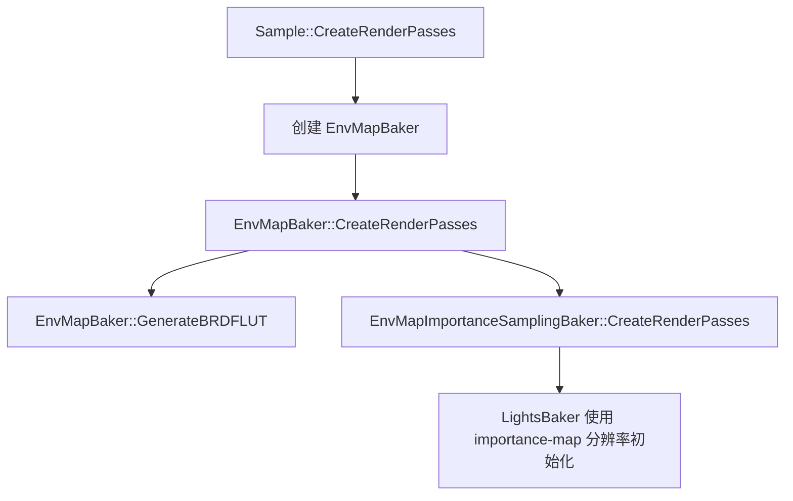
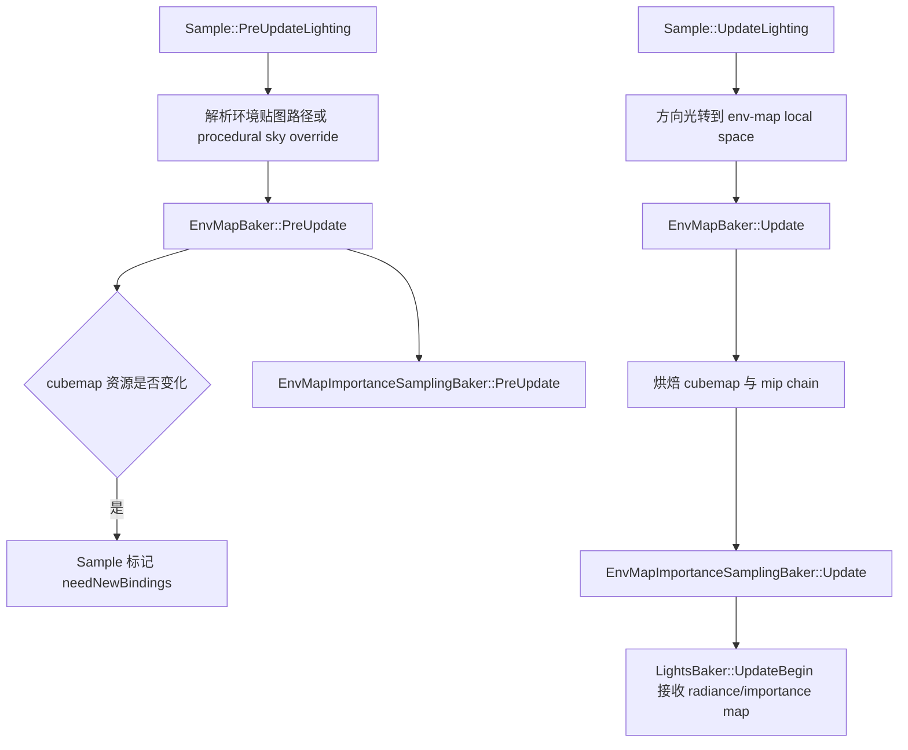
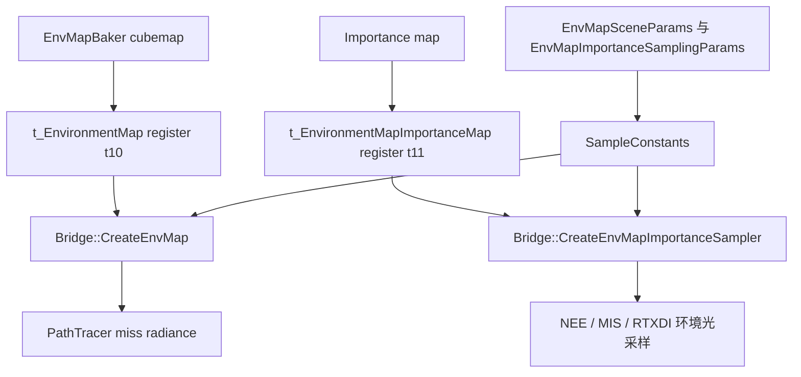

# EnvMapBaker

## 概览
`EnvMapBaker` 是 RTXPT 的远景环境光烘焙组件。它把静态 equirect/cubemap 环境贴图、procedural sky 和方向光合成为 PathTracer 可采样的 GPU cubemap，并同步生成环境光 importance/radiance map、shader 参数和部分 IBL 辅助资源。

## 职责
- 创建并维护环境贴图烘焙所需的 compute shader、PSO、binding layout、sampler、常量缓冲、cubemap、低分辨率 procedural sky prepass cubemap、可选 BC6H 输出和调试资源绑定。
- 在场景加载、环境贴图 override 或分辨率变化时重置目标分辨率、加载或卸载源贴图，并按需重建 cubemap 与 importance sampling 资源。
- 将 equirectangular texture、cubemap texture、procedural sky 和最多 `c_MaxDirLights` 个方向光烘焙到 RGBA16 cubemap，生成 solid-angle weighted mip 链，并在启用时执行 BC6H 压缩。
- 驱动 `EnvMapImportanceSamplingBaker` 为 baked cubemap 生成 equal-area octahedral importance map、radiance map、mip hierarchy 和 `EnvMapImportanceSamplingParams`。
- 向 `Sample`、`LightsBaker`、PathTracer shader bridge 和 RTXDI prepare-lights 路径暴露环境 cubemap、importance map、sampler、BRDF LUT 与 cubemap processing helper。
- 提供 `ProcessCubemap` 通用处理接口，为外部 cubemap 生成 mip、GGX prefilter cubemap 和 diffuse irradiance cubemap。
- 通过 `DebugGUI` 暴露目标 cubemap 分辨率、强制动态重烘焙、BC6H 压缩和 baked cubemap 导出等调试控制。

## 涉及文件与符号
- `Rtxpt/Lighting/Distant/EnvMapBaker.h` - `EnvMapBaker`、`BakeSettings`、`CubemapProcessingOptions`、`CubemapProcessingResults`
- `Rtxpt/Lighting/Distant/EnvMapBaker.cpp` - `CreateRenderPasses`、`PreUpdate`、`Update`、`InitBuffers`、`GenerateBRDFLUT`、`ProcessCubemap`、`GGXPrefilterCubemap`、`ConvolveDiffuseIrradiance`、`GenerateCubemapMips`
- `Rtxpt/Lighting/Distant/EnvMapBaker.hlsl` - `EnvMapBakerConstants`、`LowResPrePassLayerCS`、`BaseLayerCS`、`MIPReduceCS`、方向光贡献与 procedural sky 烘焙逻辑
- `Rtxpt/Lighting/Distant/EnvMapImportanceSamplingBaker.h` - `EnvMapImportanceSamplingBaker`、`GetImportanceMapOnly`、`GetRadianceAndImportanceMap`、`GetShaderParams`
- `Rtxpt/Lighting/Distant/EnvMapImportanceSamplingBaker.cpp` - importance/radiance map 资源创建、`PreUpdate`、`GenerateImportanceMap`、`Update`
- `Rtxpt/Lighting/Distant/EnvMapImportanceSamplingBaker.hlsl` - `BuildMIPDescentImportanceMapCS`、equal-area octahedral importance/radiance map 生成
- `Rtxpt/Lighting/Distant/CubemapProcessing.hlsl` - `GGXPrefilterCS`、`ConvolveIrradianceCS`
- `Rtxpt/Lighting/Distant/BRDFLUTGenerator.hlsl` - split-sum IBL BRDF LUT compute shader
- `Rtxpt/Lighting/Distant/SampleProceduralSky.h/.cpp/.hlsli`、`Rtxpt/Lighting/Distant/precomputed_sky.hlsli` - procedural sky 源资源与 shader 评估逻辑
- `Rtxpt/Sample.h` - `Sample::m_envMapBaker`、`Sample::GetEnvMapBaker`、`Sample::SetEnvMapOverrideSource`、`Sample::m_envMapSceneParams`
- `Rtxpt/Sample.cpp` - `CreateRenderPasses`、`PreUpdateLighting`、`UpdateLighting`、`RtxdiSetupFrame`、常量缓冲填充、PathTracer binding set 填充
- `Rtxpt/SampleUI.cpp` - Environment Map UI 控制和 `EnvMapBaker::DebugGUI` 入口
- `Rtxpt/Shaders/Bindings/LightingBindings.hlsli` - `t_EnvironmentMap`、`t_EnvironmentMapImportanceMap`
- `Rtxpt/Shaders/Bindings/SamplerBindings.hlsli` - `s_EnvironmentMapSampler`、`s_EnvironmentMapImportanceSampler`
- `Rtxpt/Shaders/PathTracerBridge.hlsli`、`Rtxpt/Shaders/PathTracerBridgeDonut.hlsli` - `Bridge::CreateEnvMap`、`Bridge::CreateEnvMapImportanceSampler`
- `Rtxpt/Shaders/PathTracer/Lighting/EnvMap.hlsli` - `EnvMap`、`EnvMapSampler`、`MIPDescentSample`、环境贴图 PDF helper
- `Rtxpt/Shaders/PathTracer/PathTracer.hlsli` - miss path 环境辐射评估和 BSDF-vs-environment MIS
- `Rtxpt/Shaders/PathTracer/PathTracerNEE.hlsli` - environment quad light 的变换与评估 hook
- `Rtxpt/RTXDI/PrepareLightsPass.cpp`、`Rtxpt/RTXDI/PolymorphicLightRTXDI.hlsli` - RTXDI 环境光绑定与采样
- `Rtxpt/IntroSample.cpp` - `IntroPathTracer::ProcessLocalCubemap`，通过 `EnvMapBaker::ProcessCubemap` 处理 local cubemap

## 架构
`Sample` 以 `std::shared_ptr<EnvMapBaker>` 持有 `m_envMapBaker`。渲染通道创建阶段会构造 baker、初始化 compute pass、尝试生成 BRDF LUT，并用其 importance-map 分辨率初始化 `LightsBaker`。每帧中，`Sample::PreUpdateLighting` 先解析实际环境来源并调用 `EnvMapBaker::PreUpdate`；随后 `Sample::UpdateLighting` 把场景方向光转换到环境贴图局部空间，调用 `EnvMapBaker::Update`，再把生成的 radiance/importance map 传给 `LightsBaker::UpdateBegin`。

帧内更新分为资源身份确认和内容烘焙两段。`PreUpdate` 会确定目标分辨率，procedural sky 默认 1024，静态背景默认 2048；通过 `TextureCache` 加载源贴图；在分辨率变化时重建 cubemap buffer；并让 importance baker 绑定当前源 cubemap。`Update` 会检测 dirty 状态、方向光变化、强制 debug rebake、procedural sky 更新或保存请求；写入 `EnvMapBakerConstants`；必要时执行 procedural low-res prepass；执行 base cubemap bake；生成 mip；可选压缩到 BC6H；然后更新 importance/radiance map 并递增 `m_versionID`。

`EnvMapBaker::Update` 会缓存上一次已烘焙的方向光数量与每个方向光的 `AngularSize`、`ColorIntensity`、`Direction`。如果这些值、环境源、procedural sky 状态、render pass dirty 状态和调试强制重烘焙开关都没有变化，`Update` 会返回 false 并复用上一轮 baked cubemap；如果方向光参数变化，则需要重新烘焙，否则太阳等方向光贡献不会反映到最终环境 cubemap。

Shader 消费分为直接环境 lookup 和 importance sampling 两条路径。`Sample::RecreateBindingSet` 将 `GetEnvMapCube()` 绑定到 `t_EnvironmentMap`，将 `GetImportanceMapOnly()` 绑定到 `t_EnvironmentMapImportanceMap`，并绑定对应 sampler。`Sample` 还会把 `envMapSceneParams` 与 `envMapImportanceSamplingParams` 写入主常量缓冲。`Bridge::CreateEnvMap` 用于 miss radiance 的直接环境采样；`Bridge::CreateEnvMapImportanceSampler` 创建 MIP descent sampler，用于 NEE、environment quad light、MIS、RTXDI 环境光 PDF 评估和 feedback 路径。

`ProcessCubemap` 是独立 helper 路径。`IntroPathTracer::ProcessLocalCubemap` 用它把 local ray-traced cubemap 处理成 mip 链、GGX-filtered specular cubemap 和 diffuse irradiance cubemap；这条路径不等同于主 distant environment map 更新，但复用了 `EnvMapBaker` 的 compute 基础设施。

## 依赖
- 内部运行时：`Sample`、`SampleUIData`、`LightsBaker`、`RtxdiPass`、`PrepareLightsPass`、`ShaderDebug`、`ComputePipelineBaker`、`RenderTargets`、`BindingCache`、`TextureCache`、`CommonRenderPasses`、`SampleProceduralSky`。
- Shader 契约：`EnvMapBakerConstants`、`EnvMapImportanceSamplingBakerConstants`、`EnvMapSceneParams`、`EnvMapImportanceSamplingParams`、`LightingBindings.hlsli`、`SamplerBindings.hlsli`、`PathTracerBridgeDonut.hlsli`。
- GPU 与框架依赖：NVRHI device/command list/resource/binding API、Donut engine/render helpers、ImGui debug UI。
- 资源与配置：场景环境贴图路径、环境贴图 override 字符串、`c_EnvMapSubFolder`、procedural sky 选项、`EnvironmentMapRuntimeParameters`、`c_envMapRadianceScale`、scene time 和 UI reset flags。

## 注意事项
- `PreUpdate` 必须先于 `GetTargetCubeResolution` 和 `Update` 执行；`GetTargetCubeResolution` 会断言 `m_targetResolution` 已建立。
- 方向光在传入 `Update` 前必须转换到环境贴图局部空间；`Sample::UpdateLighting` 已执行该转换，并按 cubemap texel 分辨率钳制 angular size。
- 调整 `DirectionalLight` 的方向、颜色、强度或角大小通常会触发 re-bake，因为方向光被直接累加进 baked envmap texel；如果方向光和其他输入都不变，则可以复用上一轮 baked cubemap。
- 调整环境贴图 `Tint Color` 或 `Intensity` 通常不需要 re-bake，因为这些值通过 `EnvMapSceneParams.ColorMultiplier` 在 shader 采样时运行时相乘。
- 调整环境贴图 `RotationXYZ` 可能触发 re-bake：代码会用该旋转把方向光转换到 env-map local space，以便太阳等方向光在世界空间中保持正确方向。
- `Update` 在 baked 内容变化时返回 true；`Sample::UpdateLighting` 会将其映射为 `m_ui.ResetAccumulation = true`，因此环境变化会重置累积与历史缓存。
- `PreUpdate` 加载源贴图时可能关闭、执行、等待 GPU idle 并重新打开 command list；保存 baked cubemap 时，`Update` 内也会执行类似流程。
- Vulkan 路径在 `PreUpdate` 中会禁用 BC6U compression，因为代码中有未解决的 Vulkan 压缩问题保护逻辑。`GetEnvMapCube()` 会根据 `m_outputIsCompressed` 返回未压缩 cubemap 或 BC6H 输出。
- Binding register 是严格 CPU/GPU 契约：`Sample.cpp` 中的 binding layout 与 binding set 必须和 `LightingBindings.hlsli`、`SamplerBindings.hlsli`、`PathTracerBridgeDonut.hlsli`、RTXDI prepare-light binding 同步维护。
- 当前检查到的构造函数接收 `enableRasterPrecompute`，但没有把它赋给 `m_enableRasterPrecompute`；该字段在 header 中默认 false。因此受 `m_enableRasterPrecompute` 保护的 BRDF LUT、GGX prefilter 和 diffuse irradiance convolution 路径会 early-out，除非其他位置初始化该字段或修正构造函数。
- `EnvMapImportanceSamplingBaker` 当前启用的采样路径是 MIP descent。presampled environment-sample 路径被 `#if 0` 禁用，`ExecutePresampling` 当前会 `assert(false)`。
- Importance/radiance map 在环境贴图局部 equal-area octahedral 空间生成。运行时 rotation、tint、intensity 和 enable 状态通过 `EnvMapSceneParams` 应用；修改采样或 PDF 逻辑时必须维护 NEE/MIS 一致性。
- `CubemapProcessingOptions` 包含 `generateImportanceMap`，但当前 `ProcessCubemap` 实现只处理 `generateMips`、`ggxPrefilter` 和 `projectToSH`；不要假设它会为外部 cubemap 生成 importance map。
- `CreateRenderPasses` 会释放 hot-reloadable processing variants，重建 PSO/layout/sampler，标记 `m_renderPassesDirty`，并重置 `m_brdfLUTGenerated`；shader reload 因此会触发重烘焙。

## 调用方
- `Sample::CreateRenderPasses` 构造并初始化 `m_envMapBaker`，调用 `CreateRenderPasses`、`GenerateBRDFLUT`，并把 importance-map 分辨率传给 `LightsBaker`。
- `Sample::LoadScene` / 场景 reload 路径在 baker 已存在时调用 `EnvMapBaker::SceneReloaded`。
- `Sample::SetEnvMapOverrideSource` 在 override 变化时重置目标 cubemap 分辨率。
- `Sample::PreUpdateLighting` 调用 `EnvMapBaker::PreUpdate`，并在 cubemap 资源变化时触发 binding 重建。
- `Sample::UpdateLighting` 调用 `EnvMapBaker::Update`，随后把 `GetImportanceSampling()->GetRadianceAndImportanceMap()` 传给 `LightsBaker::UpdateBegin`。
- `Sample::RtxdiSetupFrame` 在环境贴图启用时把 `m_envMapBaker` 传给 `RtxdiPass::PrepareResources`。
- `Sample::RecreateBindingSet` 为 PathTracer 与相关 shader 路径绑定环境 cubemap、importance map、sampler 和 BRDF LUT。
- `SampleUI::BuildUI` 的环境贴图面板调用 `SetEnvMapOverrideSource`，更新 `EnvironmentMapParams`，并调用 `EnvMapBaker::DebugGUI`。
- `PrepareLightsPass` 为 RTXDI 环境光采样绑定 `EnvMapBaker` 输出，并把 `EnvMapImportanceSamplingParams` 写入 prepare-lights constants。
- `IntroPathTracer::ProcessLocalCubemap` 调用 `EnvMapBaker::ProcessCubemap` 处理 local cubemap 的 mip、GGX 和 irradiance 资源。