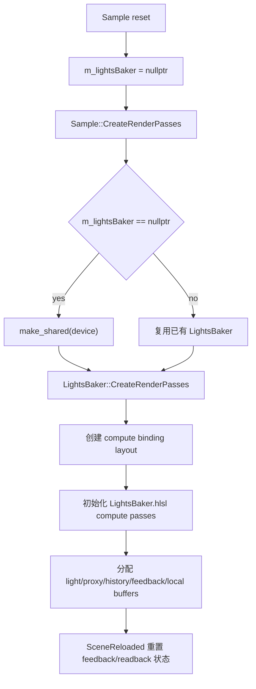
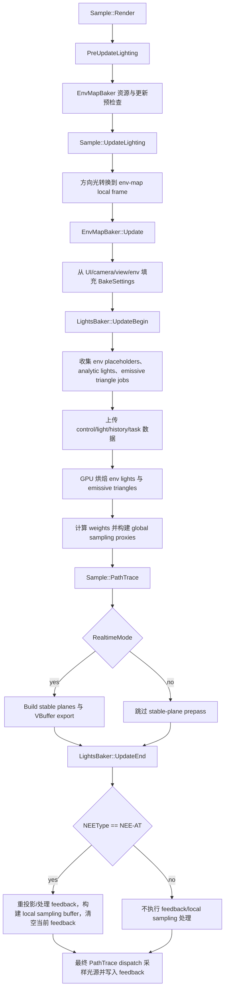
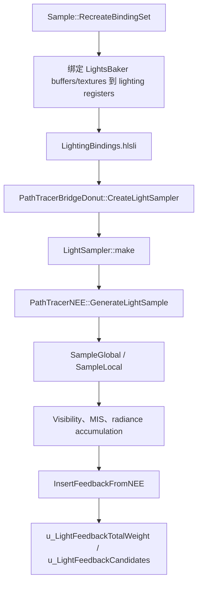

# LightsBaker

## 概览
`LightsBaker` 是 RTXPT 路径追踪光照采样的数据准备器。它把环境贴图、解析光源和自发光三角形统一整理为路径追踪器可采样的 GPU 光源数据，并在 NEE-AT 模式下维护 temporal feedback 与屏幕 tile 级 local sampling 数据。

## 职责
- 创建并持有光照准备所需的 compute pipeline、binding layout、sampler、光源 buffer、proxy buffer、feedback texture、local sampling buffer、环境光 lookup texture、scratch buffer 和 UI readback buffer。
- 将场景光照转换为路径追踪器使用的 `PolymorphicLightInfo` / `PolymorphicLightInfoEx` 条目，并维护跨帧 light history remap buffer。
- 根据光源权重和可选 temporal feedback 构建全局 light sampling proxies，向 shader 暴露 proxy counters 与 proxy indices。
- 为环境贴图光源先在 CPU 端创建 quadtree placeholder，再通过 `LightsBaker.hlsl` compute pass 在 GPU 端填充、细分和烘焙环境光节点。
- 遍历自发光几何体，写入每个 `SubInstanceData` 的 emissive light mapping offset，并创建 GPU 任务把 mesh/material 数据烘焙为 triangle lights。
- 在 NEE-AT 模式下，使用 depth 和 motion vectors 对上一帧 feedback 做重投影与过滤，构建 local tile sampling buffer，清空当前帧 feedback reservoir，供后续 PathTrace dispatch 写入新 feedback。
- 通过 `InfoGUI` / `DebugGUI` 暴露诊断信息和调试控制，并通过 `SetGlobalShaderMacros` 提供 `NEE_AT_SAMPLE_BAKED_ENVIRONMENT` 宏。

## 涉及文件与符号
- Rtxpt/Sample.h - `Sample::m_lightsBaker`、`Sample::GetLightsBaker`、`Sample::PreUpdateLighting`、`Sample::UpdateLighting`、`Sample::PathTrace`
- Rtxpt/Sample.cpp - `m_lightsBaker` 创建、场景重置、每帧更新、PathTracer binding set、`m_lightsBaker->UpdateBegin`、`m_lightsBaker->UpdateEnd`
- Rtxpt/SampleUI.cpp - `m_app.GetLightsBaker()->InfoGUI`、`m_app.GetLightsBaker()->DebugGUI`、NEE / NEE-AT UI 控制
- Rtxpt/SampleUI.h - `SampleUIData::NEEType`、`SampleUIData::ActualNEEAT_LocalToGlobalSampleRatio`
- Rtxpt/Lighting/LightsBaker.h - `LightsBaker`、`LightsBaker::BakeSettings`、buffer getter、`UpdateBegin`、`UpdateEnd`
- Rtxpt/Lighting/LightsBaker.cpp - 构造函数、`CreateRenderPasses`、光源收集、binding 填充、`UpdateBegin`、`UpdateEnd`、GUI、shader macro
- Rtxpt/Lighting/LightsBaker.hlsl - 环境光烘焙、自发光三角形烘焙、proxy 构建、feedback 处理和 local sampling buffer 生成的 compute kernels
- Rtxpt/Shaders/Bindings/LightingBindings.hlsli - `t_LightsCB`、`t_Lights`、`t_LightsEx`、proxy buffer、local sampling buffer、environment lookup、feedback UAV 的 shader register 契约
- Rtxpt/Shaders/PathTracerBridgeDonut.hlsli - `Bridge::CreateLightSampler`
- Rtxpt/Shaders/PathTracer/Lighting/LightSampler.hlsli - `LightSampler`、global/local sampling、PDF/MIS helper、feedback 写入
- Rtxpt/Shaders/PathTracer/PathTracerNEE.hlsli - NEE 光源采样与 feedback 插入
- Rtxpt/Shaders/PathTracer/Lighting/LightingTypes.hlsli - `LightingControlData`、`LightsBakerConstants`、feedback reservoir 类型

## 架构
`m_lightsBaker` 由 `Sample` 以 `std::shared_ptr<LightsBaker>` 持有。场景或 sample reset 时会置空；`Sample::CreateRenderPasses` 中在 `EnvMapBaker` 可用后按需创建，并以渲染分辨率和 processed envmap importance 分辨率初始化内部资源。

`CreateRenderPasses` 会创建 compute-only binding layout，初始化 `LightsBaker.hlsl` 中的关键 kernel，包括 `BakeEmissiveTriangles`、`EnvLightsSubdivideBase`、`EnvLightsFillLookupMap`、`ComputeWeights`、`ComputeProxyCounts`、`CreateProxyJobs`、`ExecuteProxyJobs`、`ProcessFeedbackHistoryP0/P1a/P1b/P2/P3` 和 `ClearFeedbackHistory`。随后它分配 `LightingControlData`、packed light buffers、scratch buffers、history remap buffers、light weights、per-light proxy counters、global proxy indices、`EnvLightLookupMap`、NEE-AT feedback textures、blended feedback textures、history depth 和 `NEE_AT_LocalSamplingBuffer`。

每帧生成流程：

`UpdateBegin` 是主要的光源构建阶段。它推进或重置 feedback 状态，钳制 NEE-AT 参数，写入 `LightingControlData`，收集环境光 placeholder、解析光源和自发光三角形任务，上传 CPU 侧生成的数据，然后运行 GPU pass 完成环境光、自发光三角形、光源权重、proxy count、proxy offset 和 `m_lightSamplingProxies` 构建。

`UpdateEnd` 被故意放到 depth 和 motion vectors 可用之后执行。只有 `ImportanceSamplingType == 2`，也就是 NEE-AT 时，它才执行实质工作：处理上一帧 feedback、结合 depth/motion vectors 做 reprojection/disocclusion，填充 `m_NEE_AT_LocalSamplingBuffer`，必要时运行 debug visualization，最后清空当前帧 feedback reservoir，并假设紧随其后的 PathTrace 会写入新的 feedback。

Shader 消费流程：

Path tracer binding set 会把 `LightsBaker` 输出映射到 shader registers：`GetControlBuffer` 对应 `t_LightsCB`，`GetLightBuffer` 对应 `t_Lights`，`GetLightExBuffer` 对应 `t_LightsEx`，`GetLightProxyCounters` / `GetLightSamplingProxies` 对应全局采样分布，`GetLocalSamplingBuffer` 对应 NEE-AT local tile 数据，`GetEnvLightLookupMap` 对应环境光方向查找，feedback textures 对应 `u_LightFeedbackTotalWeight` / `u_LightFeedbackCandidates`。

## 依赖
- 内部依赖：`Sample`、`SampleUIData`、`ExtendedScene`、`EnvMapBaker`、`MaterialsBaker`、`OmmBaker`、`ShaderDebug`、`RenderTargets`、`BindingCache`、`SubInstanceData`、`PTMaterial`、scene graph light/mesh extensions。
- Shader 契约：`LightingControlData`、`LightsBakerConstants`、`PolymorphicLightInfo`、`PolymorphicLightInfoEx`、lighting register bindings、NEE/NEE-AT 宏与常量。
- 外部/运行时依赖：NVRHI buffer/texture/binding layout/compute dispatch，Donut engine scene graph 与 render helpers，ImGui debug UI。
- 配置与 UI 输入：`m_ui.NEEType`、`m_ui.UseNEE`、`m_ui.NEEAT_GlobalTemporalFeedbackWeight`、`m_ui.NEEAT_LocalToGlobalSampleRatio`、`m_ui.ResetAccumulation`、`m_ui.ResetRealtimeCaches`、environment map runtime parameters。

## 注意事项
- `UpdateBegin` 与 `UpdateEnd` 是成对协议。`UpdateEnd` 必须在任何 PathTracer NEE 光源采样之前执行，并且要在 NEE-AT 重投影所需的 depth/motion vectors 可用之后执行。
- `UpdateEnd` 仅在 `ImportanceSamplingType == 2` 时执行 feedback/local sampling 工作；Uniform 和 Power sampling 仍使用 `UpdateBegin` 构建的 light list/proxy 数据，但不使用 NEE-AT feedback/local sampling。
- Realtime mode 的关键关系是：stable-plane prepass 会先写入 depth 和 motion vectors，然后 `UpdateEnd` 使用这些数据准备 local/feedback sampling，最后正式 PathTrace dispatch 消费它们。
- `ResetFeedback` 会由 frame discontinuity、显式 feedback reset 或 realtime cache reset 触发，并重置 NEE-AT feedback 可用状态和 local jitter 状态。
- CPU/GPU binding contract 很严格。修改 `Sample::RecreateBindingSet`、`LightingBindings.hlsli`、`LightsBaker::FillBindings` 或 `LightsBaker::CreateRenderPasses` 时，必须同步维护 register 与资源类型。
- 环境光条目先是 CPU placeholder，之后由 compute pass 根据 processed env-map importance texture 填充、细分，并构建 environment lookup map。
- 自发光几何处理会修改 `SubInstanceData::EmissiveLightMappingOffset` 和 `SubInstanceData::AnalyticProxyLightIndex`，因此依赖 subinstance 顺序与 TLAS/hit-group 契约保持一致。
- 光源总数可能超过 `RTXPT_LIGHTING_MAX_LIGHTS`；`TotalLightCountOverflow` 会报告该状态，`InfoGUI` 会显示相关诊断。
- `CreateRenderPasses` 在替换资源时会等待 GPU idle，特别是 feedback 和 readback 资源，以避免资源生命周期重叠和 GPU 仍在使用旧资源。
- UI 侧注释说明 `m_lightsBaker` 可以合法为空，因此 `SampleUI` 调用 `InfoGUI` / `DebugGUI` 前都会通过 `GetLightsBaker()` 判空。

## 调用方
- `Sample::CreateRenderPasses` 构造 `m_lightsBaker` 并调用 `LightsBaker::CreateRenderPasses`。
- `Sample::LoadScene` / 场景设置路径在场景变化且对象已存在时调用 `LightsBaker::SceneReloaded`。
- `Sample::FillPTPipelineGlobalMacros` 调用 `LightsBaker::SetGlobalShaderMacros`。
- `Sample::UpdateLighting` 填充 `LightsBaker::BakeSettings` 并调用 `LightsBaker::UpdateBegin`。
- `Sample::PathTrace` 在最终 path tracing ray dispatch 前调用 `LightsBaker::UpdateEnd`。
- `Sample::RecreateBindingSet` 将 `LightsBaker` 输出绑定到 path tracer binding set。
- `SampleUI` 通过 `Sample::GetLightsBaker` 调用 `InfoGUI` 和 `DebugGUI`。
- `AdvancedPathTracer::SampleRenderCode` 调用 `Sample::PathTrace`，因此 `LightsBaker` 生成的光照采样数据属于当前 active PathTrace 渲染路径的一部分。