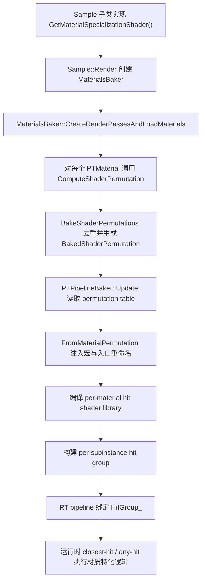

# MaterialSpecialization

## 概览
RTXPT 里的 MaterialSpecialization 不是单独的运行时类，而是一套“按材质选择并编译 hit-group 特化着色器”的机制。它把 `PTMaterial` 的属性转换为材质专属的 shader permutation，再交给 RT pipeline 去绑定对应的 closest-hit / any-hit 代码。

## 职责
- 从样例类提供的 `GetMaterialSpecializationShader()` 取得材质特化 HLSL 源文件。
- 根据 `PTMaterial` 状态生成材质 permutation 宏，决定哪些材质路径要被编译进 shader。
- 对相同 permutation 做去重，让多个材质共享同一个 hit-group shader library。
- 为 RT pipeline 提供可编译的 per-material shader library，并把 entry point 重命名成可追踪的 debug 名称。
- 对 alpha test 材质额外提供 any-hit 路径；非 alpha test 材质通常只需要 closest-hit。
- 作为“材质数据”和“ray tracing hit shader”之间的边界层，避免把所有材质逻辑都塞进单一 ubershader。

## 涉及文件与符号
- Rtxpt/Sample.h - `GetMaterialSpecializationShader()`
- Rtxpt/Sample.cpp - `m_materialsBaker = std::make_shared<MaterialsBaker>(GetMaterialSpecializationShader(), ...)`
- Rtxpt/AdvancedSample.cpp - `AdvancedPathTracer::GetMaterialSpecializationShader()`
- Rtxpt/IntroSample.cpp - `IntroPathTracer::GetMaterialSpecializationShader()`
- Rtxpt/Materials/MaterialsBaker.h - `MaterialShaderPermutation`、`PTMaterial::ComputeShaderPermutation()`、`BakeShaderPermutations()`、`m_shaderPermutationTable`、`m_ubershader`
- Rtxpt/Materials/MaterialsBaker.cpp - permutation 生成、去重、`PTMaterial::ComputeShaderPermutation()`、`MaterialsBaker::BakeShaderPermutations()`
- Rtxpt/SampleCommon/PTPipelineBaker.h - `PTPipelineVariant::ShaderPermutation`、`m_specializedPerMaterial`、`HitGroupInfo`
- Rtxpt/SampleCommon/PTPipelineBaker.cpp - `PTPipelineVariant::ShaderPermutation::FromMaterialPermutation()`、`PTPipelineBaker::UpdateFinalize()`、`ComputeSubInstanceHitGroupInfo()`
- Rtxpt/Shaders/PathTracer/Utils/Utils.hlsli - `CLOSESTHIT_ENTRY`、`ANYHIT_ENTRY`、`RTXPT_MATERIAL_PERMUTATION_NAME`
- Rtxpt/Shaders/PathTracerMaterialSpecializations.hlsl - Advanced sample 的默认材质特化 hit shader
- Rtxpt/Shaders/IntroSample/IntroPathTracer.hlsl - Intro sample 的另一套材质特化 hit shader
- Rtxpt/Shaders/PathTracer/Materials/MaterialPT.h - `PTMaterialData`、`PTMaterialFlags_*`
- Rtxpt/Shaders/PathTracer/Scene/Material/MaterialData.hlsli - material header 位域与 thin surface / PSD 标志

## 架构
样例类先决定“材质特化 shader 文件用哪一个”。`AdvancedPathTracer` 返回 `PathTracerMaterialSpecializations.hlsl`，`IntroPathTracer` 返回 `IntroPathTracer.hlsl`。`Sample::Render` 在初始化 `MaterialsBaker` 时把这个路径传进去。

`PTMaterial::ComputeShaderPermutation()` 会先把材质数据压成 `PTMaterialData`，再决定要不要打开某些编译期宏。当前真正启用的核心宏很少，主要是 `RTXPT_MATERIAL_PERMUTATIONS_ENABLED=1`，以及在材质既不是 emissive 也不是 analytic proxy 时显式关掉相关路径；其余潜在 specialization 点（thin surface、transmission、unique name 等）大多还保留在注释里。

`MaterialsBaker::BakeShaderPermutations()` 会生成一个 ubershader 变体作为兜底，再把所有材质 permutation 去重，写入 `m_shaderPermutationTable`。之后 `PTPipelineBaker::Update()` 用这张表生成 `m_specializedPerMaterial`，并在 `UpdateFinalize()` 里把每个唯一 permutation 绑定到对应的 `closest-hit` / `any-hit` library。

HLSL 端的入口名是通过 `Utils.hlsli` 里的宏拼出来的。`CLOSESTHIT_ENTRY` 和 `ANYHIT_ENTRY` 最终会被扩展成 `ClosestHit_<pipeline id>_<material permutation>` / `AnyHit_<...>`，这样同一个源文件可以被编译成多份材质专属库。`PathTracerMaterialSpecializations.hlsl` 本身只做很薄的一层包装：closest-hit 调 `PathTracer::HandleHit()`，any-hit 调 `Bridge::AlphaTest()` 并在需要时 `IgnoreHit()`。

## 依赖
- 内部依赖：`Sample`、`AdvancedPathTracer`、`IntroPathTracer`、`MaterialsBaker`、`PTPipelineBaker`、`PTMaterial`、`SubInstanceData`、`ExtendedScene`。
- Shader 依赖：`PathTracer/PathTracer.hlsli`、`PathTracerBridgeDonut.hlsli`、`Utils.hlsli`、`MaterialPT.h`、`MaterialData.hlsli`。
- 外部依赖：Donut 的 `ShaderFactory` / `TextureCache` / scene graph，NVRHI ray tracing pipeline 与 shader library 支持。

## 注意事项
- 这是“hit shader 特化”，不是路径追踪主循环特化；它主要影响 closest-hit / any-hit，而不是 raygen 主流程。
- 相同宏集的材质会共享同一个 permutation，所以这里的去重直接影响编译量和 hit group 数量。
- alpha test 材质才需要 any-hit；非 alpha test 材质通常只走 closest-hit。
- `m_ubershader` 仍然保留，但代码注释已经表明它更像兼容/回退方案，未来可能被进一步弱化。
- 改动 `GetMaterialSpecializationShader()` 会改变整个样例使用的材质特化源文件，属于影响面较大的入口选择。

## 调用方
- `AdvancedPathTracer::GetMaterialSpecializationShader()` 返回 `PathTracerMaterialSpecializations.hlsl`
- `IntroPathTracer::GetMaterialSpecializationShader()` 返回 `IntroPathTracer.hlsl`
- `Sample::Render` 在 `m_materialsBaker == nullptr` 时创建 `MaterialsBaker`
- `PTPipelineBaker::Update()` / `UpdateFinalize()` 消费 `MaterialsBaker` 生成的 permutation 表并构建 RT hit groups
