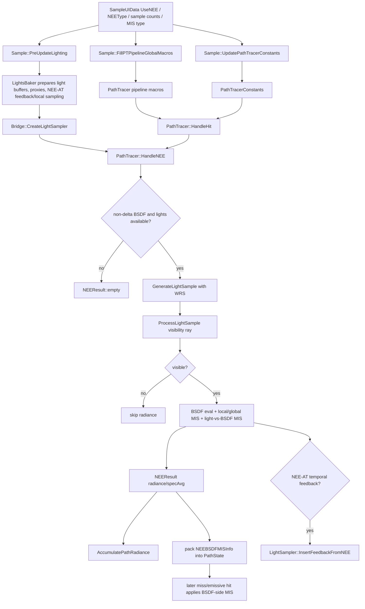

# NEE

## Overview
NEE（Next Event Estimation）在 RTXPT PathTracer 中是直接光重要性采样路径：每个可应用的表面散射点会显式采样光源、发射 shadow/visibility ray，并把可见光贡献直接累加到 path radiance。它的主要作用是降低直接光、环境光和小面积/高能量 emissive 光源的噪声，同时为 NEE-AT 和 ReSTIR DI 提供光源采样/MIS/反馈接口。

## Responsibilities
- 在主 path tracing shader 中对非 delta BSDF lobe 执行直接光采样，避免只依赖 BSDF 随机散射命中光源。
- 使用 `LightSampler` 在全局光源分布和 NEE-AT 局部分布之间抽取候选光源，并通过 Weighted Reservoir Sampling 选出待 visibility test 的样本。
- 对可见 light sample 计算 BSDF、shadow ray 可见性、局部/全局采样 MIS、light-vs-BSDF MIS、firefly filter 和 stable-plane specular radiance average。
- 将 `NEEBSDFMISInfo` 写入 path state，使后续 BSDF 命中 emissive triangle、analytic light proxy 或 environment miss 时能做反向 MIS，避免 NEE 与 BSDF 路径双计直接光。
- 在 NEE-AT 模式下把 NEE 采样贡献反馈给 `LightsBaker`，用于下一帧/后续阶段构建 temporal feedback 和 local tile sampling buffer。
- 在 realtime + ReSTIR DI 场景下让 RTXDI DI 替代 dominant stable plane 上的 NEE，并通过 `SkipEmissiveBRDF` 抑制对应的反射 emissive BRDF 贡献。

## Involved Files & Symbols
- Rtxpt/Shaders/PathTracer/PathTracerNEE.hlsli - `PathTracer::HandleNEE`, `HandleNEE_MultipleSamples`, `GenerateLightSample`, `ProcessLightSample`, `ComputeVisibilityRay`, `NEEWeightedReservoirSampler`
- Rtxpt/Shaders/PathTracer/PathTracer.hlsli - `HandleHit` 内调用 `HandleNEE`; miss / surface emissive / analytic proxy 分支使用 `NEEBSDFMISInfo` 做 BSDF-side MIS
- Rtxpt/Shaders/PathTracer/PathTracerTypes.hlsli - `NEEBSDFMISInfo`, `NEEResult`, `SurfaceData::neeTriangleLightIndex`, `SurfaceData::neeAnalyticLightIndex`
- Rtxpt/Shaders/PathTracer/Lighting/LightSampler.hlsli - `LightSampler::SampleGlobal`, `SampleLocal`, `GetCandidateSampleCounts`, `ComputeLightVsBSDF_MIS_ForLight`, `ComputeBSDFMISForEmissiveTriangle`, `ComputeBSDFMISForEnvironmentQuad`, `InsertFeedbackFromNEE`
- Rtxpt/Shaders/PathTracer/Lighting/LightingTypes.hlsli - `ComputeCandidateSampleLocalCount`, `ComputeCandidateSampleGlobalCount`, `RTXPT_INVALID_LIGHT_INDEX`
- Rtxpt/Shaders/PathTracerBridgeDonut.hlsli - `Bridge::CreateLightSampler`, `Bridge::traceVisibilityRay`, `Bridge::AlphaTestVisibilityRay`, `Bridge::CreateEnvMap`, surface light-index export
- Rtxpt/Shaders/PathTracer/PathTracerShared.h - `PathTracerConstants::NEEEnabled`, `NEEType`, `NEECandidateSamples`, `NEEFullSamples`, `useReSTIRDI`
- Rtxpt/Sample.cpp - `Sample::FillPTPipelineGlobalMacros`, `Sample::PreUpdateLighting`, `Sample::UpdatePathTracerConstants`, `Sample::PathTrace`
- Rtxpt/SampleUI.h - `SampleUIData::UseNEE`, `NEEType`, `NEECandidateSamples`, `NEEFullSamples`, `NEEMISType`, `ActualUseReSTIRDI`, `ActualUseApproximateMIS`, `ActualNEEAT_LocalToGlobalSampleRatio`
- Rtxpt/SampleUI.cpp - Path Tracer / Next Event Estimation UI controls and tooltips
- Rtxpt/Lighting/LightsBaker.h - `LightsBaker::BakeSettings` and supported sampling approaches: Uniform, Power, NEE-AT
- Rtxpt/Lighting/LightsBaker.cpp - NEE-AT feedback/resource setup, `UpdateEnd` feedback/local sampling processing
- Rtxpt/Lighting/LightsBaker.hlsl - light proxy weights and feedback blending used by NEE-AT
- Rtxpt/Materials/MaterialsBaker.cpp - material UI and GPU flag for `ExcludeFromNEE`
- Rtxpt/Shaders/SubInstanceData.h - `SubInstanceData::Flags_ExcludeFromNEE`

## Architecture
NEE sits inside the per-bounce hit handling path, after the shader has current `ShadingData` / `ActiveBSDF` and before the path continues with its next BSDF scatter. It is compiled out by `PT_NEE_ENABLED == 0`, and `PathTracer.hlsli` also bypasses it for non path-tracing passes and `PATH_TRACER_MODE_BUILD_STABLE_PLANES`.

Core shader flow:
- `PathTracer::HandleHit` calls `HandleNEE(preScatterPath, shadingData, bsdf, uniformSG, workingContext)` unless the pass is non-path-tracing, build-stable-planes, or `PT_NEE_ENABLED` is false.
- `HandleNEE` creates a `LightSampler` from `Bridge::CreateLightSampler(pixelPos, rayConeWidth, sceneLength)`, clamps/uses `NEEFullSamples`, and only proceeds when the BSDF has non-delta lobes, the light sampler is non-empty, and `fullSamples > 0`.
- In realtime fill-stable-planes with `PT_USE_RESTIR_DI`, if the path is on the dominant stable plane, `HandleNEE` returns an empty result with `SkipEmissiveBRDF = true`; this lets ReSTIR DI handle direct lighting for that surface and suppresses the corresponding reflective emissive BRDF path.
- `HandleNEE_MultipleSamples` loops `fullSamples`; each full sample calls `GenerateLightSample`, then `ProcessLightSample`. UI describes full samples as the samples that require shadow rays.
- `GenerateLightSample` draws `NEECandidateSamples` candidates from `LightSampler::SampleGlobal` or `SampleLocal`. Local/global split comes from `GetCandidateSampleCounts`, which only allows local samples for screen-space-coherent paths when NEE-AT local sampling is active.
- Candidate weight is `max3(lightSample.Li) * bsdf.evalPdf(...)` in the current cheaper path. Weighted Reservoir Sampling chooses one candidate and corrects its contribution by candidate probability.
- `ProcessLightSample` offsets the ray origin by the shading/face normal, shortens `TMax` toward the light, calls `Bridge::traceVisibilityRay`, then for visible samples applies grazing-angle fadeout, WRS local/global MIS, light-vs-BSDF MIS, BSDF evaluation, optional firefly filtering, and pre-scatter path throughput before accumulating `NEEResult`.
- After NEE returns, `PathTracer.hlsli` stores `NEEBSDFMISInfo` in the path state, extracts `RadianceAndSpecAvg`, and calls `AccumulatePathRadiance`. The fourth component carries specular radiance average used by stable-plane/denoising logic.
- Later, if the continued BSDF path hits the environment, an emissive triangle, or an analytic light proxy, `PathTracer.hlsli` unpacks `NEEBSDFMISInfo` and computes BSDF-side MIS through `LightSampler` so the BSDF-sampled direct event and the earlier NEE light-sampled event stay balanced.

CPU/control flow:
- `Sample::FillPTPipelineGlobalMacros` emits `PT_NEE_ENABLED`, `PT_USE_RESTIR_DI`, `RTXPT_USE_APPROXIMATE_MIS`, `RTXPT_NEE_FULL_SAMPLE_COUNT`, `RTXPT_NEE_LOCAL_CANDIDATE_SAMPLE_COUNT`, `RTXPT_NEE_GLOBAL_CANDIDATE_SAMPLE_COUNT`, `RTXPT_NEE_TOTAL_CANDIDATE_SAMPLE_COUNT`, and debug discard macros.
- `Sample::UpdatePathTracerConstants` writes `useReSTIRDI/GI` plus runtime NEE constants into `PathTracerConstants`.
- `Sample::PreUpdateLighting` passes `NEEType`, NEE-AT feedback weight, local/global ratio, approximate-MIS choice, and distant-vs-local importance scale into `LightsBaker::BakeSettings`.
- `LightsBaker` supports Uniform, Power, and NEE-AT. In NEE-AT mode it keeps feedback textures, blends prior-frame contribution feedback, builds global sampling proxies and local tile sampling buffers, and clears feedback storage before path tracing fills it again.

## Dependencies
- `PathTracer` shader state: `PathState`, `ShadingData`, `ActiveBSDF`, `NEEResult`, `NEEBSDFMISInfo`, ray cone / path length / pixel position metadata.
- Lighting data prepared by `LightsBaker`: `LightingControlData`, `t_Lights`, `t_LightsEx`, proxy counters/indices, local sampling buffer, env lookup map, feedback total weight/candidate textures.
- Scene/material bridge: `Bridge::CreateLightSampler`, `Bridge::traceVisibilityRay`, `SceneBVH`, alpha/opacity handling, `SubInstanceData` flags, material emissive and analytic proxy metadata.
- Environment map path: `Bridge::CreateEnvMap`, environment quad light helpers in `PathTracerNEE.hlsli`, and env map importance data.
- Runtime controls from `SampleUIData`: `UseNEE`, `NEEType`, `NEECandidateSamples`, `NEEFullSamples`, `NEEMISType`, Realtime mode, ReSTIR DI/GI toggles, DLSS-RR restrictions, debug discard toggles.
- Optional integrations: stable planes / denoising guide logic for `specAvg`, RTXDI ReSTIR DI replacement on dominant stable planes, NEE-AT feedback passes in `LightsBaker`.

## Notes
- NEE is direct light importance sampling. In the UI tooltip it explicitly includes ReSTIR DI but not ReSTIR GI; `ActualUseReSTIRDI()` also requires `UseNEE`, realtime mode, `UseReSTIRDI`, and DLSS-RR compatibility.
- Disabling `UseNEE` compiles out the NEE path via `PT_NEE_ENABLED`; UI tooltip notes analytic lights currently only come out of NEE, so they can be missing when NEE is disabled.
- `NEECandidateSamples` are only candidates and are not visibility tested. Increasing them can improve light choice but can hurt quality/perf in heavily shadowed scenes; `NEEFullSamples` are the shadow-tested/integrated samples.
- `NEEBSDFMISInfo` packs candidate and full sample counts into 6 bits each, so shader/UI clamp sample counts to `RTXPT_LIGHTING_MAX_SAMPLE_COUNT` and the packed limit is 63.
- The current candidate weighting path intentionally ignores color for cost reasons and uses `max3(lightSample.Li) * bsdf.evalPdf(...)`; comments say the full-color BSDF weight was more expensive and not worth it in common cases.
- Full MIS is used in reference by default, while realtime defaults can use approximate MIS through `ActualUseApproximateMIS()`. Approximate MIS is faster but UI notes it can be noisier, especially for reference accumulation.
- NEE-AT local samples are disabled unless `NEEType == 2`. With `RTXPT_LIGHTING_NEEAT_ENABLE_WORLDSPACE_LOCAL_LAYER == 0`, local samples are also gated by `LightSampler::IsScreenSpaceCoherentHeuristic`.
- `Bridge::AlphaTestVisibilityRay` treats `SubInstanceData::Flags_ExcludeFromNEE` as invisible to NEE shadow rays. The material UI labels this as biased, because it can intentionally ignore occluders for NEE only.
- `PathTracerNEE.hlsli` uses environment quad light helper functions to connect polymorphic environment-light sampling to the actual environment map evaluation.
- `RTXPT_DISCARD_NEE_LIGHTING` and `RTXPT_DISCARD_NON_NEE_LIGHTING` are debug macros for separating NEE and non-NEE lighting contributions.

## Callers
- `PathTracer::HandleHit` calls `HandleNEE` for eligible path-tracing modes before continuing the BSDF scatter path.
- `PathTracer::HandleMiss` consumes packed `NEEBSDFMISInfo` for environment BSDF-side MIS.
- `PathTracer::HandleHit` emissive/analytic-light sections consume packed `NEEBSDFMISInfo` for emissive triangle and analytic proxy BSDF-side MIS.
- `Sample::Render` / `Sample::PreUpdateLighting` prepare `LightsBaker` settings before `LightsBaker::UpdateEnd` and path tracing dispatch.
- `Sample::PathTrace` dispatches the path tracing shaders that execute NEE, then optionally runs RTXDI final shading and denoising/merge follow-up passes.