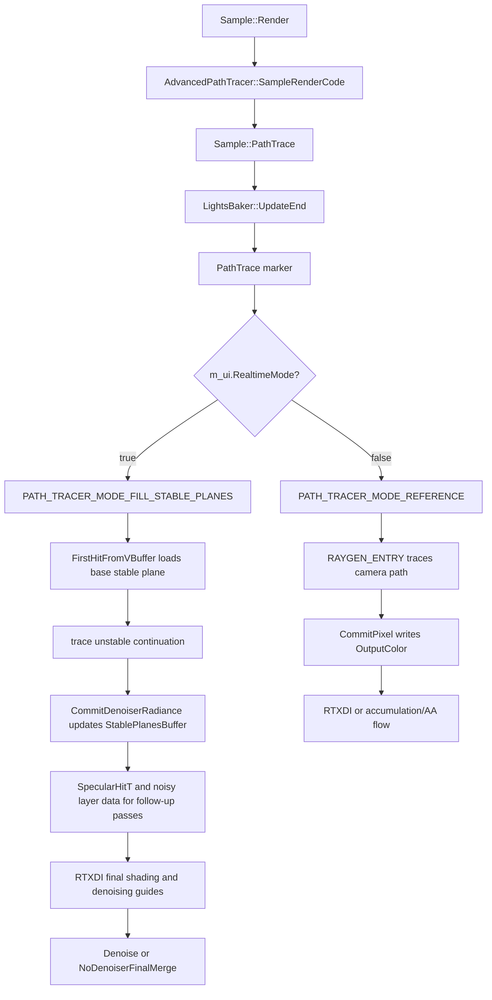

# PathTrace

## Overview
`PathTrace` 是 `Sample::PathTrace` 中以 GPU marker `"PathTrace"` 包裹的主 ray tracing 派发块，不是独立 C++ pass 类。它在 reference 模式下直接运行 `PATH_TRACER_MODE_REFERENCE` 生成 HDR radiance，在 realtime 模式下承接 `PathTracePrePass` 已构建的 stable planes，运行 `PATH_TRACER_MODE_FILL_STABLE_PLANES` 填充 noisy radiance 与 denoising guide 所需的 specular hit distance。

## Responsibilities
- 根据 `m_ui.RealtimeMode` 在 reference pipeline 与 fill-stable-planes pipeline 之间选择 RT shader table，并复用主路径追踪 binding set 与 bindless descriptor table。
- 按 `m_ui.ActualSamplesPerPixel()` 为同一帧逐次下发 ray dispatch，通过 `SampleMiniConstants.params.x` 把 `subSampleIndex` 传入 shader sample index 计算。
- 在相邻 dispatch 之间为 `StablePlanesBuffer` 和 `SpecularHitT` 建立 UAV 状态顺序点，避免连续 `dispatchRays` 读写同一资源时出现竞争。
- 在 reference 模式中追踪完整 camera path，累积 emissive、environment、NEE/BSDF 等 radiance，并由 `CommitPixel` 写入 `RenderTargets::OutputColor`。
- 在 realtime fill 模式中从 pre-pass 的 base stable plane 继续追踪，把 unstable/noisy radiance 累加到 stable-plane payload，并导出后续 denoising guides、RTXDI final shading 和 final merge 所依赖的数据。

## Involved Files & Symbols
- Rtxpt/Sample.cpp - `Sample::PathTrace`, `Sample::Render`, `Sample::UpdatePathTracerConstants`, `Sample::Denoise`, `Sample::PostProcessAA`
- Rtxpt/Sample.h - `Sample::PathTrace`, `Sample::SampleRenderCode`
- Rtxpt/AdvancedSample.cpp - `AdvancedPathTracer::SampleRenderCode`, `AdvancedPathTracer::CreateRTPipelines`
- Rtxpt/Shaders/PathTracerSample.hlsl - `RAYGEN_ENTRY`, `FirstHitFromVBuffer`, `nextHit`, `postProcessHit`
- Rtxpt/Shaders/PathTracer/PathTracer.hlsli - `StartPixel`, `AccumulatePathRadiance`, `CommitPixel`, `HandleHit`, `HandleMiss`
- Rtxpt/Shaders/PathTracer/PathTracerStablePlanes.hlsli - `StablePlanesOnScatter`, `StablePlanesHandleHit`, `StablePlanesHandleMiss`
- Rtxpt/Shaders/PathTracer/StablePlanes.hlsli - `StablePlanesContext::CommitDenoiserRadiance`, `StablePlanesContext::GetAllRadiance`
- Rtxpt/Shaders/PathTracerBridgeDonut.hlsli - `Bridge::getSampleIndex`, `Bridge::getNoisyRadianceAttenuation`, `Bridge::ExportSpecHitTStart`, `Bridge::ExportSpecHitTStop`, `GetWorkingContext`
- Rtxpt/Shaders/Bindings/ShaderResourceBindings.hlsli - `g_Const`, `g_MiniConst`, path tracing UAV bindings
- Rtxpt/Shaders/PathTracer/PathTracerShared.h - `PathTracerConstants`
- Rtxpt/ProcessingPasses/PostProcess.hlsl - `NO_DENOISER_FINAL_MERGE` and denoiser input/merge compute paths
- Rtxpt/ProcessingPasses/DenoisingGuidesBaker.cpp - `DenoisingGuidesBaker::DenoiseSpecHitT`, `DenoisingGuidesBaker::ComputeAvgLayerRadiance`
- Rtxpt/RTXDI/DIFinalShading.hlsl - DI final contribution writes to stable-plane radiance or output color
- Rtxpt/RTXDI/GIFinalShading.hlsl - GI final contribution writes to stable-plane radiance or output color

## Architecture
`Sample::Render` 更新 scene、AS、lighting、path tracer constants 和 binding set 后调用虚函数 `SampleRenderCode`。当前高级样例实现 `AdvancedPathTracer::SampleRenderCode` 先在需要时调用 `RtxdiPass::BeginFrame`，再调用 `Sample::PathTrace`，最后调用 `Sample::Denoise`。`PathTrace` marker 块位于 `LightsBaker::UpdateEnd` 之后、RTXDI final shading 与 `Denoising Guides Bake` 之前，因此它消费本帧已准备好的场景/材质/光照状态，并产出后续 radiance 合成和降噪引导的核心中间结果。

CPU 编排集中在 `Sample::PathTrace` 的 marker 块：
- `useStablePlanes` 直接取自 `m_ui.RealtimeMode`。实时模式选择 `m_ptPipelineFillStablePlanes->GetShaderTable()`；非实时模式选择 `m_ptPipelineReference->GetShaderTable()`。
- 每次 dispatch 都绑定 `m_bindingSet` 与 `m_DescriptorTable->GetDescriptorTable()`，dispatch 尺寸来自当前 `m_view` viewport。
- 循环次数是 `m_ui.ActualSamplesPerPixel()`。每轮把 `SampleMiniConstants { uint4(subSampleIndex, 0, 0, 0) }` 写入 push constants，再执行一次 fullscreen `dispatchRays(args)`。
- shader 通过 `Bridge::getSampleIndex()` 计算 `g_Const.ptConsts.sampleBaseIndex + g_MiniConst.params.x`。CPU 在 `UpdatePathTracerConstants` 中把 `sampleBaseIndex` 设为 `m_sampleIndex * ActualSamplesPerPixel()`，并把 `invSubSampleCount` 设为 `1 / ActualSamplesPerPixel()`。
- 每轮 dispatch 前设置 `StablePlanesBuffer` 与 `SpecularHitT` 为 `UnorderedAccess`，每轮 dispatch 后再次设置 `SpecularHitT`，循环结束后再次设置 `StablePlanesBuffer`。源码注释将循环内的状态设置说明为避免 back-to-back `dispatchRays` 的 race condition。

reference shader 路径：
- `PathTracerSample.hlsl::RAYGEN_ENTRY` 从 camera ray 初始化 `PathState`，调用 `PathTracer::StartPixel`，然后在 `while (path.isActive())` 中执行 `nextHit` 和命中后处理。
- reference 模式不从 stable plane 续跑。命中与 miss 会通过 `Bridge::ExportSurface` / `Bridge::ExportNonSurface` 刷新 depth、motion vectors、throughput 等 guide 数据。
- `PathTracer::AccumulatePathRadiance` 把 radiance 累到 `path.L`；`PathTracer::CommitPixel` 将 `path.L.rgb` 写到 `workingContext.OutputColor`，也就是 `RenderTargets::OutputColor`。
- reference 模式随后在 `Sample::PostProcessAA` 进入 accumulation pass，而不是 realtime stable-plane merge。

realtime fill shader 路径：
- 该路径依赖前面的 `PathTracePrePass`。`RAYGEN_ENTRY` 调用 `FirstHitFromVBuffer(path, 0, workingContext)`，从 plane 0 的 stable plane payload 取出 ray origin、ray dir、throughput、branch id、vertex index 与 dominant-plane 信息，并收窄第一次 ray query 的 `tMin/tMax`。
- fill mode 追踪 stable plane 之后的 noisy continuation。`StablePlanesOnScatter` 在分支仍匹配已构建 stable branch 时切换到对应 stable plane；离开 stable branch 后继续把 noisy radiance 归属到当前 layer。
- `AccumulatePathRadiance` 在 fill mode 中只对不在 stable branch 上的 radiance 做 noisy 累积；单帧多 sub-sample 时，`Bridge::getNoisyRadianceAttenuation()` 使用 `invSubSampleCount` 缩放 noisy radiance，避免多次 fill dispatch 把 noisy 项直接放大。
- `CommitPixel` 在 fill mode 不写 `OutputColor`，而是调用 `StablePlanesContext::CommitDenoiserRadiance`，把 `path.L` 与 specular average 累到当前 stable plane 的 `PackedNoisyRadianceAndSpecAvg`。
- dominant denoising layer 上的镜面路径会通过 `Bridge::ExportSpecHitTStart` / `Bridge::ExportSpecHitTStop` 更新 `u_SpecularHitT`。紧随其后的 `DenoisingGuidesBaker::DenoiseSpecHitT` 会对该纹理做 ping/pong 平滑。

后续交接：
- 若启用 RTXDI，`Sample::PathTrace` 在 marker 后执行 DI/GI final shading。开启 denoising 时，DI/GI final contribution 继续加到 dominant stable plane 的 `PackedNoisyRadianceAndSpecAvg`；否则会直接加到 `u_OutputColor`。
- `Denoising Guides Bake` 随后平滑 `SpecularHitT` 并计算平均 layer radiance。
- realtime 下若使用独立 NRD，`Sample::Denoise` 以 stable-plane layer 为单位准备输入、运行 denoiser，再合并回 `OutputColor`；若 realtime 且没有 denoiser，`NoDenoiserFinalMerge` 通过 `StablePlanesContext::GetAllRadiance` 把 stable radiance 与 noisy layer radiance 合成到 `OutputColor`。

## Dependencies
- CPU orchestration: `Sample`, `AdvancedPathTracer`, `RenderTargets`, `PTPipelineBaker`, `MaterialsBaker`, `LightsBaker`, `DenoisingGuidesBaker`, `PostProcess`, optional `RtxdiPass`, optional `NrdIntegration`。
- RT pipeline variants: `m_ptPipelineReference` and `m_ptPipelineFillStablePlanes`, both created from `PathTracerSample.hlsl` by `AdvancedPathTracer::CreateRTPipelines`。
- Scene and shader binding contract: `m_bindingSet`, bindless descriptor table, `SampleConstants`, `SampleMiniConstants`, TLAS/scene/material/light bindings, and UAV bindings declared in `ShaderResourceBindings.hlsli`。
- Stable-plane data contract in realtime mode: `StablePlanesHeader`, `StablePlanesBuffer`, `StableRadiance`, `PathTracePrePass` outputs, and `PathTracerConstants` stable-plane stride/count settings。
- Runtime controls: `m_ui.RealtimeMode`, `m_ui.ActualSamplesPerPixel()`, bounce/NEE/firefly settings, denoiser selection, ReSTIR DI/GI flags, stable-plane settings, frame/sample indices。

## Notes
- `PathTrace` marker 与 `Sample::PathTrace` 函数名接近，但 marker 只覆盖主 path dispatch loop；前面的 `PathTracePrePass`、`VBufferExport`、`LightsBaker::UpdateEnd` 与后面的 RTXDI、denoising guide bake 都在 marker 外。
- reference 与 realtime fill 的主要输出不同。reference 由 `CommitPixel` 直接写 `OutputColor`；fill mode 主要写 `StablePlanesBuffer` 的 noisy radiance，最终颜色要等 NRD merge、DLSS-RR 准备流程或 `NoDenoiserFinalMerge` 等下游流程完成。
- fill mode 不能脱离 pre-pass 单独理解。它把 plane 0 当作 base stable plane/vbuffer 入口，依赖 pre-pass 已写好的 stable-plane payload、stable radiance、depth/motion/throughput 与 dominant branch 信息。
- `SampleMiniConstants.params.x` 在该块中就是 sub-sample 索引来源。改动 push constant 布局、sample index 计算或 `ActualSamplesPerPixel()` 语义时，需要同时检查随机序列、noisy radiance 衰减和连续 dispatch 累加结果。
- 源码明确把 `StablePlanesBuffer` 与 `SpecularHitT` 的状态设置放在 back-to-back dispatch 之间作为竞态规避点；不要把这些调用当作无效重复直接删除。
- `Bridge::ExportSpecHitTStop` 只在当前像素的 hit distance 仍处于负的“起点已记录”状态时完成导出；多 sub-sample 情况下后续 dispatch 可能看到已有正值并跳过覆盖。
- CPU binding set 和 HLSL register 是共享契约。`OutputColor`、`SpecularHitT`、stable-plane UAV 或 surface-data 绑定变更时，需要同步检查 `Sample::RecreateBindingSet`、`ShaderResourceBindings.hlsli`、RTXDI final shading、post-process merge 与 denoising guides。

## Callers (optional)
- `Sample::Render` 调用虚函数 `SampleRenderCode`，为 path tracing 提前准备 constants、lighting 与 binding state。
- `AdvancedPathTracer::SampleRenderCode` 在可选 `RtxdiPass::BeginFrame` 后调用 `Sample::PathTrace`，并在其后调用 `Sample::Denoise`。
