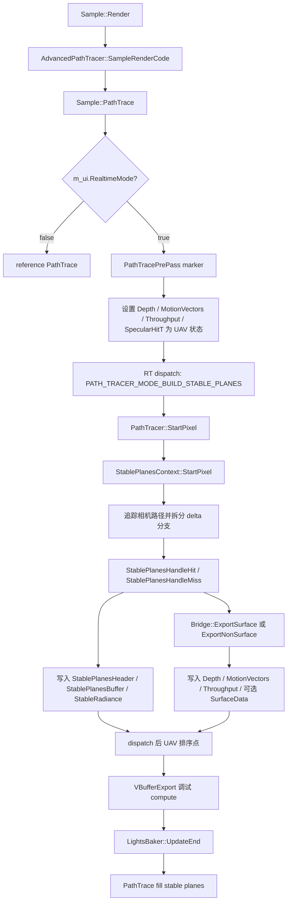

# PathTracePrePass

## Overview
`PathTracePrePass` 是 `Sample::PathTrace` 中实时模式专用的 GPU marker，不是独立 C++ pass 类。它在 `m_ui.RealtimeMode == true` 时使用 `PATH_TRACER_MODE_BUILD_STABLE_PLANES` ray tracing 变体，先构建 stable planes / VBuffer 类数据、主导平面的深度/运动向量/throughput 以及可选 ReSTIR surface data，再交给后续 `PATH_TRACER_MODE_FILL_STABLE_PLANES` 主路径追踪填充 noisy radiance。

## Responsibilities
- 在实时 stable planes 模式下初始化每像素 stable-plane 状态，包括 stable radiance 清零、stable branch id 清空、first-hit ray length / dominant plane header 写入。
- 沿相机主路径追踪确定每个像素的 base stable plane；遇到镜面/折射等 delta lobe 时按 active stable plane 数量拆分并排队探索分支。
- 为 dominant stable plane 导出 VBuffer/denoising/temporal 所需的 depth、screen motion vectors、throughput 和 optional surface data。
- 收集 build pass 中可稳定复用的 emissive/environment radiance 到 `StableRadiance`，使后续 fill pass 只负责 unstable/noisy 部分。
- 在 dispatch 前后设置关键 UAV resource state，避免与后续 VBufferExport、fill stable planes、RTXDI 和 denoising guide pass 产生读写次序问题。

## Involved Files & Symbols
- Rtxpt/Sample.cpp - `Sample::PathTrace`, `Sample::RecreateBindingSet`, `Sample::UpdatePathTracerConstants`, `Sample::Render`
- Rtxpt/Sample.h - `Sample::PathTrace`, RT pipeline handles and render target members
- Rtxpt/AdvancedSample.cpp - `AdvancedPathTracer::SampleRenderCode`, `AdvancedPathTracer::CreateRTPipelines`
- Rtxpt/SampleCommon/RenderTargets.h - `RenderTargets`
- Rtxpt/SampleCommon/RenderTargets.cpp - render target and stable plane buffer allocation
- Rtxpt/Shaders/PathTracer/Config.h - `PATH_TRACER_MODE_BUILD_STABLE_PLANES`
- Rtxpt/Shaders/PathTracerSample.hlsl - `RAYGEN_ENTRY`, `postProcessHit`, `nextHit`
- Rtxpt/Shaders/PathTracer/PathTracer.hlsli - `StartPixel`, `AccumulatePathRadiance`, `CommitPixel`, `HandleHit`, `HandleMiss`
- Rtxpt/Shaders/PathTracer/PathTracerStablePlanes.hlsli - `SplitDeltaPath`, `StablePlanesHandleHit`, `StablePlanesHandleMiss`
- Rtxpt/Shaders/PathTracer/StablePlanes.hlsli - `StablePlane`, `StablePlanesContext`
- Rtxpt/Shaders/PathTracerBridgeDonut.hlsli - `GetWorkingContext`, `loadSurface`, `computeMotionVector`, `ExportSurfaceInit`, `ExportSurface`, `ExportNonSurface`
- Rtxpt/Shaders/Bindings/ShaderResourceBindings.hlsli - global UAV/SRV bindings for path tracing outputs
- Rtxpt/Shaders/Bindings/SceneBindings.hlsli - TLAS, scene, material and bindless resource bindings
- Rtxpt/Shaders/Bindings/LightingBindings.hlsli - environment/local-light sampling bindings
- Rtxpt/Shaders/Bindings/ReSTIRBindings.hlsli - optional ReSTIR GI surface/radiance resources
- Rtxpt/ProcessingPasses/ExportVisibilityBuffer.hlsl - current follow-up compute pass, mostly debug visualization because VBuffer export moved into build pass
- Rtxpt/RTXDI/SurfaceData.hlsli - later RTXDI consumers of `SurfaceDataBuffer`

## 架构
`AdvancedPathTracer::CreateRTPipelines` 注册了 `PathTracerSample.hlsl` 的三个变体：reference、build stable planes 和 fill stable planes。`PathTracePrePass` 只有在 `Sample::PathTrace` 判断当前处于实时模式时，才会选择 `m_ptPipelineBuildStablePlanes`；reference 模式会完全跳过这个块。

`Sample::PathTrace` 中的 CPU 编排：
- 根据 `m_view->GetViewport()` 计算 dispatch 尺寸，并为 pre-pass 初始化 `SampleMiniConstants` 为 `{0, 0, 0, 0}`。
- 实时模式下打开 `PathTracePrePass` marker，将 `Depth`、`ScreenMotionVectors`、`Throughput` 和 `SpecularHitT` 设为 `UnorderedAccess`，绑定 `m_bindingSet` 与 bindless descriptor table，选择 `m_ptPipelineBuildStablePlanes->GetShaderTable()`，随后执行一次 `dispatchRays(args)`。
- dispatch 之后，显式把 `StablePlanesBuffer`、`Depth`、`ScreenMotionVectors` 和 `Throughput` 重新设为 `UnorderedAccess`；这相当于在 `VBufferExport` 和后续 pass 之前建立就近的资源顺序点。
- pre-pass 之后立即运行 `VBufferExport` compute。该 shader 旧的 VBuffer 导出主体已被 `#if 0` 关闭；当前主要用于基于 `u_MotionVectors` / `u_Depth` 输出 VBuffer debug view。

构建模式下的 shader 流程：
- `RAYGEN_ENTRY` 构造主相机射线，创建 `WorkingContext`，调用 `PathTracer::StartPixel`，然后循环执行 `nextHit -> postProcessHit`，直到当前 path 与所有排队的 split path 都结束。
- `StartPixel` 调用 `StablePlanesContext::StartPixel`，后者重置 stable radiance，并把 plane header 0..2 标记为 invalid；如果编译启用了 `PT_USE_RESTIR_GI`，还会清空 secondary-surface ReSTIR GI 资源。随后调用 `Bridge::ExportSurfaceInit`，将 depth 与 specular hit distance 置为 0，作为 invalid 默认值。
- `StablePlanesHandleHit` 决定当前命中是否成为 base stable plane，或者是否需要拆分 delta lobes。它会写入 branch id、排队的 split payload、stable plane 数据、roughness、normal、BSDF estimate、throughput 与 motion vector。dominant plane 命中会调用 `Bridge::ExportSurface`。
- `StablePlanesHandleMiss` 写入 sky/miss stable plane 数据；对于 dominant miss path，会调用 `Bridge::ExportNonSurface`。
- `AccumulatePathRadiance` 在 build mode 中把稳定的 emissive/environment 贡献写入 `StableRadiance`。`CommitPixel` 在 build mode 中不写 `OutputColor`；noisy radiance 延后到 fill mode 处理。

构建 dispatch 的资源读取：
- 常量与控制数据：`g_Const` / `SampleConstants`、push constants `g_MiniConst`，以及 `PathTracerConstants` 中的 image size、sample index、stable plane count、max stable plane vertex depth、ReSTIR 开关和 frame index 等字段。
- 场景与几何数据：`SceneBVH`、`t_SubInstanceData`、`t_InstanceData`、`t_GeometryData`、`t_GeometryDebugData`、`t_PTMaterialData`，以及 Donut 材质/几何采样所需的 bindless buffers/textures。
- 环境与材质采样资源：`t_EnvironmentMap`、`t_EnvironmentMapImportanceMap`、material sampler 和 environment sampler。local-light buffer 通过 `LightingBindings` 绑定；build mode 会禁用 NEE，但如果相关宏/开关使环境 MIS 或反馈路径生效，仍可能引用 light sampling 数据。
- 前一帧变换数据：build mode 会读取 instance previous transform 与 previous vertex position，用于计算 screen motion vector。

构建 dispatch 的资源写入：
- `u_StableRadiance` / `RenderTargets::StableRadiance`：逐像素重置，并累积稳定的 emissive/environment radiance。
- `u_StablePlanesHeader` / `RenderTargets::StablePlanesHeader`：存储 stable plane 0..2 的 branch id，并在 array slice 3 中存储 first-hit ray length 和 dominant stable plane index。
- `u_StablePlanesBuffer` / `RenderTargets::StablePlanesBuffer`：存储 `StablePlane` payload、排队的 split-path payload、throughput、motion vector、roughness、normal、BSDF estimate 与 branch 元数据。
- `u_Depth` / `RenderTargets::Depth`：先初始化为 0，再由 dominant surface 或 miss export 覆写。
- `u_MotionVectors` / `RenderTargets::ScreenMotionVectors`：由 dominant surface 或 miss export 写入。
- `u_Throughput` / `RenderTargets::Throughput`：dominant surface export 写入 packed surface throughput；non-surface export 写入 0。
- `u_SpecularHitT` / `RenderTargets::SpecularHitT`：在 `ExportSurfaceInit` 中初始化为 0；真正用于 denoiser 的 specular hit distance 由后续 fill mode 生成。
- `u_SurfaceData` / `RenderTargets::SurfaceDataBuffer`：当 ReSTIR DI 或 GI 启用时条件写入；地址使用基于 `frameIndex` 的 2-plane ping-pong 布局。
- `u_SecondarySurfacePositionNormal` 与 `u_SecondarySurfaceRadiance`：当编译启用 `PT_USE_RESTIR_GI` 时，在 build mode 中条件清空。
- debug UAV（`u_FeedbackBuffer`、`u_DebugLinesBuffer`、`u_DebugDeltaPathTree`、`u_DeltaPathSearchStack`、debug viz texture）：只在 debug、pick 或 line visualization 路径激活时写入。
- `u_LightFeedbackTotalWeight` 和 `u_LightFeedbackCandidates`：只可能通过条件 lighting feedback 路径被影响；它们不是 stable-plane 构建的主要输出。

本 pre-pass 绑定但不产出的资源：
- `u_OutputColor` 存在于 `WorkingContext` 中，但 build mode 的 `CommitPixel` 不写它。
- `u_ProcessedOutputColor`、`u_PostTonemapOutputColor`、denoiser radiance outputs、DLSS-RR inputs、SSR/local cubemap targets 和 GBuffer render target textures 都属于全局 binding layout 的一部分，但不是 `PathTracePrePass` 的主要输出。

## 依赖
- 内部 CPU 系统：`Sample`、`AdvancedPathTracer`、`RenderTargets`、`PTPipelineBaker`、`MaterialsBaker`、`LightsBaker`、`EnvMapBaker`、`RtxdiPass`、`DenoisingGuidesBaker`、`ShaderDebug`。
- 内部 shader 模块：`PathTracerSample.hlsl`、`PathTracer.hlsli`、`PathTracerStablePlanes.hlsli`、`StablePlanes.hlsli`、`PathTracerBridgeDonut.hlsli`、`ShaderResourceBindings.hlsli`、`SceneBindings.hlsli`、`LightingBindings.hlsli`、`ReSTIRBindings.hlsli`。
- 渲染目标绑定契约：`Sample::Init` / `Sample::RecreateBindingSet` 中的 CPU binding slot 必须与 `ShaderResourceBindings.hlsli` 及相关 binding header 中的 HLSL register 保持一致。
- GPU 数据契约：`StablePlane`、`PathPayload`、`PackedPathTracerSurfaceData`、`SubInstanceData`、`PTMaterialData` 和 `PathTracerConstants` 必须保持 CPU/GPU 布局兼容。
- 运行时设置：`m_ui.RealtimeMode`、`m_ui.StablePlanesActiveCount`、`m_ui.StablePlanesMaxVertexDepth`、`m_ui.AllowPrimarySurfaceReplacement`、`m_ui.ActualUseReSTIRDI()`、`m_ui.ActualUseReSTIRGI()`、`m_ui.ActualUseRTXDIPasses()`。

## 注意事项
- `PathTracePrePass` 是 `Sample::PathTrace` 内的 marker 命名块；搜索名为 `PathTracePrePass` 的类或方法，只会找到 marker 字符串。
- 该 pre-pass 在非实时/reference 模式下会被跳过。reference 模式使用 `m_ptPipelineReference` 和 accumulation，而不是 stable planes。
- build mode 有意避开 noisy BSDF sampling、NEE 和 Russian roulette。它只跟踪 stable/delta path，存储 stable plane base，累积 stable radiance，然后终止 build path。
- active stable plane count 受 shader 常量限制（`cStablePlaneCount` 为 3，`cStablePlaneMaxVertexIndex` 为 15）。修改这些值会影响 buffer sizing、branch id encoding 和 denoiser 假设。
- `StablePlanesBuffer` 使用 `GenericTSComputeStorageElementCount(RenderSize.x, RenderSize.y, cStablePlaneCount)`；`SurfaceDataBuffer` 使用 two-plane history/ping-pong 布局。修改这些 stride 时，需要同步保持 `genericTSLineStride` 和 `genericTSPlaneStride` 一致。
- `Depth == 0` 在 surface 或 non-surface export 覆写前作为 invalid/no-data 信号使用。
- `StablePlanesBuffer`、`Depth`、`ScreenMotionVectors` 和 `Throughput` 周围的 post-dispatch state call 很重要，因为后续紧邻的 block 会读写同一批资源。
- `SpecularHitT` 在该 pre-pass 中只会被重置；denoiser 真正需要的 specular hit distance 由 fill stable planes mode 生成。
- `VBufferExport` 当前历史导出逻辑已关闭，不应再视为 VBuffer 数据的主要来源；该职责已经移动到 build stable planes ray dispatch 中。
- 为该 pass 增删资源时，需要同步更新 CPU binding layout、binding set 创建、HLSL register，以及 RTXDI、denoising guides、TAA/DLSS 和 debug visualization 等下游消费者。

## 调用方（可选）
- `Sample::Render` 更新 scene、AS、lighting、constants 和 binding sets，然后调用虚函数 `SampleRenderCode`。
- `AdvancedPathTracer::SampleRenderCode` 在启用时调用 `RtxdiPass::BeginFrame`，随后调用 `Sample::PathTrace`，最后调用 `Denoise`。
- `Sample::PathTrace` 只在实时模式下执行 `PathTracePrePass`；它位于 `VBufferExport`、`LightsBaker::UpdateEnd`、fill stable planes path tracing、RTXDI execution 和 denoising guide bake 之前。
