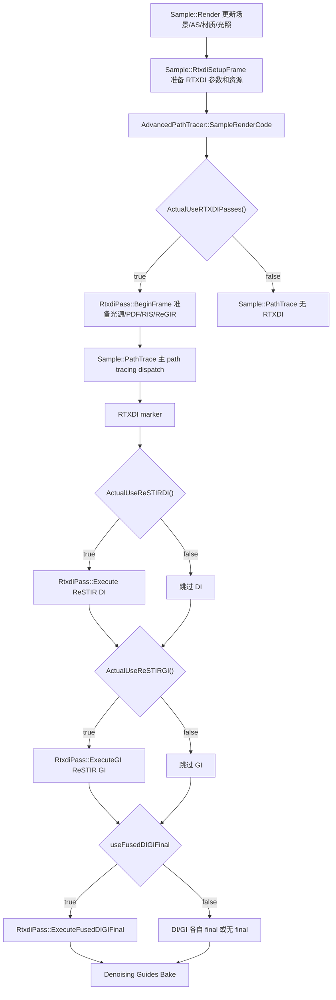

# RTXDI

## Overview
RTXDI 在本项目中是实时模式下可选的 ReSTIR DI / ReSTIR GI 通道，由 `Sample` 负责每帧准备，由 `RtxdiPass` 管理 RTXDI 上下文、资源、绑定和具体 pass 调度。本文重点记录 `Sample::PathTrace` 中 `RAII_SCOPE( m_commandList->beginMarker("RTXDI");, m_commandList->endMarker(); );` 包裹的执行流程。

## Responsibilities
- 在实时渲染模式中根据 UI 开关启用 ReSTIR DI、ReSTIR GI 或二者组合，参考模式不进入 RTXDI pass。
- 每帧把相机、帧号、渲染尺寸、RTXDI 用户设置、环境光状态和场景光源信息同步到 `RtxdiPass`。
- 管理 RTXDI 的 light buffer、RIS buffer、DI/GI reservoir buffer、local-light PDF texture、neighbor offsets 和 `RtxdiBridgeConstants`。
- 在路径追踪主派发之后执行 DI/GI reservoir 生成、时间/空间重采样和最终 shading，将结果累加到 `OutputColor` 或稳定平面的 noisy radiance。
- 当 ReSTIR DI 和 ReSTIR GI 同时启用时，可使用 fused final pass 合并两个最终 shading，避免重复读取 GBuffer。

## Involved Files & Symbols
- Rtxpt/Sample.cpp - `Sample::RtxdiSetupFrame`
- Rtxpt/Sample.cpp - `Sample::PathTrace`
- Rtxpt/Sample.cpp - `Sample::UpdatePathTracerConstants`
- Rtxpt/Sample.cpp - `Sample::PostUpdatePathTracing`
- Rtxpt/AdvancedSample.cpp - `AdvancedPathTracer::SampleRenderCode`
- Rtxpt/SampleUI.h - `SampleUIData::ActualUseRTXDIPasses`
- Rtxpt/SampleUI.h - `SampleUIData::ActualUseReSTIRDI`
- Rtxpt/SampleUI.h - `SampleUIData::ActualUseReSTIRGI`
- Rtxpt/RTXDI/RtxdiPass.h - `RtxdiPass`
- Rtxpt/RTXDI/RtxdiPass.cpp - `RtxdiPass::PrepareResources`
- Rtxpt/RTXDI/RtxdiPass.cpp - `RtxdiPass::BeginFrame`
- Rtxpt/RTXDI/RtxdiPass.cpp - `RtxdiPass::Execute`
- Rtxpt/RTXDI/RtxdiPass.cpp - `RtxdiPass::ExecuteGI`
- Rtxpt/RTXDI/RtxdiPass.cpp - `RtxdiPass::ExecuteFusedDIGIFinal`
- Rtxpt/RTXDI/RtxdiPass.cpp - `RtxdiPass::CreatePipelines`
- Rtxpt/RTXDI/RtxdiPass.cpp - `RtxdiPass::CreateBindingSet`
- Rtxpt/RTXDI/RtxdiResources.h - `RtxdiResources`
- Rtxpt/RTXDI/RtxdiResources.cpp - `RtxdiResources::RtxdiResources`
- Rtxpt/RTXDI/RtxdiResources.cpp - `RtxdiResources::InitializeNeighborOffsets`
- Rtxpt/RTXDI/GenerateInitialSamples.hlsl - DI 初始采样
- Rtxpt/RTXDI/TemporalResampling.hlsl - DI 时间重采样
- Rtxpt/RTXDI/SpatialResampling.hlsl - DI 空间重采样
- Rtxpt/RTXDI/DIFinalShading.hlsl - DI 最终贡献
- Rtxpt/RTXDI/GITemporalResampling.hlsl - GI 时间重采样
- Rtxpt/RTXDI/GISpatialResampling.hlsl - GI 空间重采样
- Rtxpt/RTXDI/GIFinalShading.hlsl - GI 最终贡献
- Rtxpt/RTXDI/FusedDIGIFinalShading.hlsl - DI/GI 合并最终贡献
- Rtxpt/RTXDI/RtxdiApplicationBridge.hlsli - RTXDI shader bridge

## Architecture
`SampleUIData::ActualUseRTXDIPasses()` 是 RTXDI 总开关：`RealtimeMode && (UseReSTIRDI || UseReSTIRGI)`。实际 DI 还要求 `UseNEE`，且 DI/GI 都会受 DLSS-RR 相关禁用条件影响。`ActualSamplesPerPixel()` 在启用 DI 或 GI 时强制为 1，因此 RTXDI 与当前代码中的多 SPP 实时路径不并行使用。

每帧 `Sample::Render` 在场景刷新、AS 更新、材质上传和光照更新之后调用 `Sample::RtxdiSetupFrame`。该函数构造 `RtxdiBridgeParameters`：帧号来自 `m_frameIndex`，尺寸来自 `m_renderSize`，相机位置来自 `m_camera`，用户设置来自 `m_ui.RTXDI`；`usingLightSampling` 与 `usingReGIR` 当前都跟随 `ActualUseReSTIRDI()`。随后 `RtxdiPass::PrepareResources` 创建或更新 `ImportanceSamplingContext`、shader pipelines、`PrepareLightsPass`、RTXDI buffers/textures 和 binding set。

`AdvancedPathTracer::SampleRenderCode` 在 `PathTrace` 前调用 `RtxdiPass::BeginFrame`。`BeginFrame` 如果 `usingLightSampling` 为 true，会先运行 `PrepareLightsPass::Process` 生成 RTXDI light buffer 参数，再写入 `RtxdiBridgeConstants`。随后它生成 local-light PDF mip、可选预采样 local lights、可选预采样 env map，并在 ReGIR 启用时构建 ReGIR 结构。这些数据供后面的 `Sample::PathTrace` 内 RTXDI marker 段消费。

`Sample::PathTrace` 的 RTXDI marker 位于主 path tracing dispatch 之后、`Denoising Guides Bake` 之前。前置 path tracing pass 已经写出 GBuffer 语义所需的 depth、motion vectors、throughput、stable-plane 数据和 radiance 目标；RTXDI final shading 依赖这些数据读取主表面并累加直接/间接采样贡献。

`useFusedDIGIFinal` 在 `Sample::PathTrace` 中由 `ActualUseReSTIRDI() && ActualUseReSTIRGI() && enableFusedDIGIFinal` 决定，其中 `enableFusedDIGIFinal` 当前是函数内静态 true。该值作为 `skipFinal` 传给 `RtxdiPass::Execute` 与 `RtxdiPass::ExecuteGI`：当 fused 模式开启时，DI 和 GI 先只完成 reservoir 生成/重采样，跳过各自 final shading，最后统一调用 `ExecuteFusedDIGIFinal`。

`RtxdiPass::Execute` 是 ReSTIR DI 分支。它以 DI context 的 render width/height 为 dispatch size，先运行 `Generate Initial Samples`，再按 DI resampling mode 可选运行 `Temporal Re-sampling` 和 `Spatial Re-sampling`。每次跨 reservoir 读写阶段之间都会对 `LightReservoirBuffer` 插入 UAV barrier。若 `skipFinal == false`，最后运行 `Final Sampling`，将选中的直接光样本做可见性和 BSDF 评估后累加到目标 radiance。

`RtxdiPass::ExecuteGI` 是 ReSTIR GI 分支。它以 GI context 的 render width/height 为 dispatch size，固定运行 `Temporal Resampling`，并在 GI resampling mode 为 Spatial 或 TemporalAndSpatial 时运行 `Spatial Resampling`。GI 分支在阶段之间对 `GIReservoirBuffer` 插入 UAV barrier。若 `skipFinal == false`，最后运行 `Final Shading`，读取二级表面位置/法线/radiance reservoir，执行可选 final visibility 和 MIS 后累加间接贡献。

`RtxdiPass::ExecuteFusedDIGIFinal` 使用 DI context 的 render width/height 调度 `Fused DI GI Final Shading`。该 shader 以 include 方式复用 `DIFinalShading.hlsl` 和 `GIFinalShading.hlsl` 的最终贡献函数，在同一次 full-screen dispatch 中计算 DI 与 GI。若启用 denoising，它写入 dominant stable plane 的 `PackedNoisyRadianceAndSpecAvg`；否则直接累加到 `u_OutputColor[pixelPos]`。

`RtxdiPass::CreatePipelines` 初始化的关键 shader 包括：DI 预采样 local/env/ReGIR、DI initial/temporal/spatial/final、GI temporal/spatial/final，以及 fused DI/GI final。`RtxdiPass::CreateBindingSet` 把 RTXDI 专用资源绑定到固定槽位：light data、neighbor offsets、light index mapping、local-light PDF、geometry-instance-to-light、DI/GI reservoirs、RIS buffers、`RtxdiBridgeConstants` 和 linear wrap sampler。

## Dependencies
- 内部依赖：`Sample`、`AdvancedPathTracer`、`RenderTargets`、`ExtendedScene`、`MaterialsBaker`、`OmmBaker`、`LightsBaker`、`EnvMapBaker`、`ShaderDebug`、`PrepareLightsPass`、`GenerateMipsPass`。
- GPU/渲染依赖：NVRHI command list、ray tracing/compute pass、bindless descriptor table、TLAS/SceneBVH、stable-plane buffers、`OutputColor`、depth、motion vectors、throughput、GBuffer 读取路径。
- 外部库：RTXDI / ReSTIR DI / ReSTIR GI / ReGIR、Donut engine/render framework、可选 DXR opacity micromap 宏。
- Shader 输入：`RtxdiBridgeConstants`、`SampleConstants`、`RAB_Surface`、DI/GI reservoir buffers、light buffers、secondary-surface buffers、stable-plane buffers。

## Notes
- `RAII_SCOPE` 在这里主要用于 NVRHI GPU marker 成对管理，`RTXDI` marker 内部还会嵌套 `ReSTIR DI`、`ReSTIR GI`、`Generate Initial Samples`、`Temporal/Spatial Resampling`、`Final Sampling/Shading` 等 marker。
- `ActualUseRTXDIPasses()` 只要求 UI 请求 DI 或 GI，但 `ActualUseReSTIRDI()` 额外要求 `UseNEE`。因此可能创建/进入 RTXDI 总路径，但 DI 分支实际不执行，只执行 GI。
- `RtxdiSetupFrame` 当前把 `usingLightSampling` 和 `usingReGIR` 都设为 `ActualUseReSTIRDI()`；源码注释说明仅 GI 需要 RTXDI context 时可以跳过 PDF、presampling 和 ReGIR pass。
- DI final shader 在 denoising 开启时写 stable-plane dominant radiance；denoising 关闭时写 `u_OutputColor`。GI final 和 fused final 采用同样的输出分流。
- Fused final 只在 DI 和 GI 同时实际启用时生效；其目的不是合并全部 resampling，而是合并最后 DI/GI shading，减少重复 GBuffer 读取。
- DI 分支的 fused spatiotemporal mode 在 C++ 里标注为未实现；当前 `RtxdiPass::Execute` 仍按 initial、temporal、spatial、final 的组合执行。
- `RtxdiResources` 会按 emissive mesh/triangle、primitive light、geometry instance 数量扩容；若场景光源或几何实例超过已有容量，`PrepareResources` 会丢弃并重建 RTXDI resources 和 binding set。
- `ResetRealtimeCaches`、RtxdiPass static ReGIR 参数变化、binding/pass 重建都会触发 `RtxdiPass::Reset`，清空 RTXDI context、resources、PDF mip pass 和 binding set。
- RTXDI reservoir buffer 阶段之间依赖 UAV barrier；修改 pass 顺序或合并 pass 时必须重新检查 `LightReservoirBuffer` 与 `GIReservoirBuffer` 的读写可见性。
- RTXDI 与 path tracer shader 宏/常量有双重契约：`FillPTPipelineGlobalMacros` 写入 `PT_USE_RESTIR_DI/GI`，`UpdatePathTracerConstants` 写入 `constants.useReSTIRDI/GI`。修改开关语义时要同时检查 C++、HLSL 宏和运行时常量。

## Callers
- `Sample::Render` 每帧在资源和光照准备阶段调用 `Sample::RtxdiSetupFrame`。
- `AdvancedPathTracer::SampleRenderCode` 在 `PathTrace` 前调用 `RtxdiPass::BeginFrame`。
- `Sample::PathTrace` 在 path tracing dispatch 之后进入 `RTXDI` marker 并调用 `RtxdiPass::Execute`、`RtxdiPass::ExecuteGI`、`RtxdiPass::ExecuteFusedDIGIFinal`。
- `Sample::PostUpdatePathTracing` 在帧尾调用 `RtxdiPass::EndFrame`，当前实现为空。