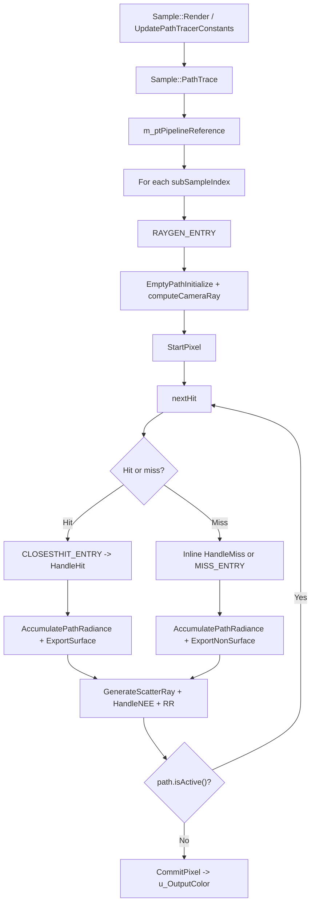

# ReferencePathTrace

## Overview
`ReferencePathTrace` covers the `PATH_TRACER_MODE_REFERENCE` branch of the RTXPT path tracer. It is the non-stable-plane baseline used by `m_ptPipelineReference`: the raygen shader builds a fresh `PathState` per pixel/sub-sample, traces a full camera path, accumulates radiance directly into the path payload, and commits the final HDR color to `u_OutputColor`.

## Responsibilities
- Select the reference RT pipeline when `Sample::PathTrace` runs in non-realtime mode.
- Drive one raygen dispatch per sub-sample using `ActualSamplesPerPixel()` and `SampleMiniConstants.params.x` as the sample offset.
- Trace camera rays through `PathTracerSample.hlsl` with `CLOSESTHIT_ENTRY`, `ANYHIT_ENTRY`, and `MISS_ENTRY` support.
- Accumulate emissive, environment, and NEE radiance directly into `PathState::L`, not into stable-plane buffers.
- Export depth, motion vectors, throughput, and optional GBuffer/debug data for later RTXDI and post-process passes.
- Terminate paths via bounce limits and Russian roulette, then write the final color in `CommitPixel`.

## Involved Files & Symbols
- `Rtxpt/AdvancedSample.cpp` - `AdvancedPathTracer::CreateRTPipelines`
- `Rtxpt/Sample.cpp` - `Sample::PathTrace`, `Sample::UpdatePathTracerConstants`
- `Rtxpt/Sample.h` - `m_ptPipelineReference`
- `Rtxpt/SampleCommon/PTPipelineBaker.cpp` - `PTPipelineVariant::UpdateFinalize`, `PTPipelineBaker::CreateVariant`
- `Rtxpt/Shaders/PathTracer/Config.h` - `PATH_TRACER_MODE_REFERENCE`
- `Rtxpt/Shaders/PathTracerSample.hlsl` - `RAYGEN_ENTRY`, `nextHit`, `postProcessHit`, `MISS_ENTRY`
- `Rtxpt/Shaders/PathTracerMaterialSpecializations.hlsl` - `CLOSESTHIT_ENTRY`, `ANYHIT_ENTRY`
- `Rtxpt/Shaders/PathTracer/PathTracer.hlsli` - `EmptyPathInitialize`, `StartPixel`, `HandleHit`, `HandleMiss`, `AccumulatePathRadiance`, `GenerateScatterRay`, `HandleNEE`, `HandleRussianRoulette`, `CommitPixel`
- `Rtxpt/Shaders/PathTracer/PathTracerBridgeDonut.hlsli` - `computeCameraRay`, `traceScatterRay`, `loadSurface`, `AlphaTest`, `ExportSurfaceInit`, `ExportSurface`, `ExportNonSurface`, `GetWorkingContext`
- `Rtxpt/Shaders/PathTracer/PathTracerNEE.hlsli` - `HandleNEE`
- `Rtxpt/Shaders/PathTracer/PathTracerNestedDielectrics.hlsli` - `HandleNestedDielectrics`
- `Rtxpt/Shaders/PathTracer/PathState.hlsli` - `PathState`, `PathFlags`, `PackedCounters`
- `Rtxpt/Shaders/PathTracer/PathPayload.hlsli` - `PathPayload::pack`, `PathPayload::unpack`
- `Rtxpt/Shaders/Bindings/ShaderResourceBindings.hlsli` - `u_OutputColor`, `u_Depth`, `u_MotionVectors`, `u_Throughput`, `u_SpecularHitT`

## Architecture
`AdvancedPathTracer::CreateRTPipelines` registers a `PathTracerSample.hlsl` variant with `PATH_TRACER_MODE=PATH_TRACER_MODE_REFERENCE`. `PTPipelineBaker` then builds the RT PSO and shader table around `RayGen_REF`, `Miss_REF`, and per-material `ClosestHit_REF_*` / `AnyHit_REF_*` exports. The pipeline uses `maxRecursionDepth = 1`; path continuation is handled by the raygen loop, not recursive tracing.

`Sample::PathTrace` picks `m_ptPipelineReference` when `m_ui.RealtimeMode` is false, binds the main descriptor set plus the bindless table, and dispatches once per sub-sample. `Sample::UpdatePathTracerConstants` feeds the sample stream through `sampleBaseIndex = m_sampleIndex * ActualSamplesPerPixel()` and `invSubSampleCount`, so every dispatch gets a distinct RNG slice.

`PathTracerSample.hlsl::RAYGEN_ENTRY` creates the path with `EmptyPathInitialize`, then calls `Bridge::computeCameraRay`, `StartPixel`, and a `while (path.isActive())` loop. `postProcessHit` is build-only; in reference mode it does nothing.

`nextHit` has two execution styles. With SER / hit-object support it uses `Bridge::traceScatterRay` and `RayQuery` inline, so misses are handled directly in raygen and transparent triangles are filtered through `Bridge::AlphaTest`. Without that path it falls back to `TraceRay(SceneBVH, ...)`, which makes `CLOSESTHIT_ENTRY`, `ANYHIT_ENTRY`, and `MISS_ENTRY` active. Both paths converge into the same `PathTracer::HandleHit` / `HandleMiss` logic via `PathPayload`.

`PathTracer::HandleHit` advances the path, loads material and geometry state through `Bridge::loadSurface`, resolves nested dielectrics, accumulates emissive surface radiance, applies NEE via `HandleNEE`, generates the next BSDF bounce, and uses Russian roulette plus bounce-count limits to decide whether to terminate. In reference mode, `AccumulatePathRadiance` adds radiance straight into `path.L`, and `CommitPixel` writes `path.L.rgb` to `u_OutputColor`.

`HandleMiss` advances the path, samples the environment map with MIS, exports guide data with `ExportNonSurface`, accumulates sky radiance, and terminates the path. `Bridge::ExportSurface` and `ExportNonSurface` also write depth, motion vectors, throughput, and optional compressed GBuffer data for downstream passes such as RTXDI.

## Dependencies
- CPU orchestration: `Sample`, `AdvancedPathTracer`, `RenderTargets`, `PTPipelineBaker`, `MaterialsBaker`, `LightsBaker`, optional `RtxdiPass`, optional `NrdIntegration`.
- Shader binding contract: `m_bindingSet`, bindless descriptor table, `SampleConstants`, `SampleMiniConstants`, and UAVs declared in `ShaderResourceBindings.hlsli`.
- Scene and material data: TLAS / sub-instance data, material permutations, alpha-test state, environment map, and light-sampler state.
- Runtime controls: `m_ui.RealtimeMode`, `ActualSamplesPerPixel()`, reference AA / firefly settings, bounce limits, NEE flags, and camera jitter.

## Notes
- `PATH_TRACER_MODE_REFERENCE` explicitly ignores stable planes; the shared `WorkingContext.StablePlanes` object still exists, but the reference branch does not read or write the stable-plane accumulation flow.
- `Bridge::ExportSurfaceInit` zeros `u_Depth` and `u_SpecularHitT` up front so downstream consumers can detect invalid pixels.
- `postProcessHit` is only used by stable-plane build mode; it is effectively a no-op here.
- The reference branch still uses `HandleRussianRoulette`, so the final color is unbiased only because the throughput correction is applied after current-bounce radiance is accumulated.
- `UpdatePathTracerConstants` uses the reference firefly threshold path, and `SampleMiniConstants.params.x` is the per-dispatch sub-sample index that feeds every shader-side sample generator.
- `PTPipelineBaker` always exports the miss shader, while any-hit export depends on the pipeline's hit-object / alpha-test configuration.

## Callers
- `AdvancedPathTracer::CreateRTPipelines` registers the reference variant.
- `Sample::PathTrace` selects it when `m_ui.RealtimeMode` is false.
- `Sample::Render` reaches it through `AdvancedPathTracer::SampleRenderCode`.
