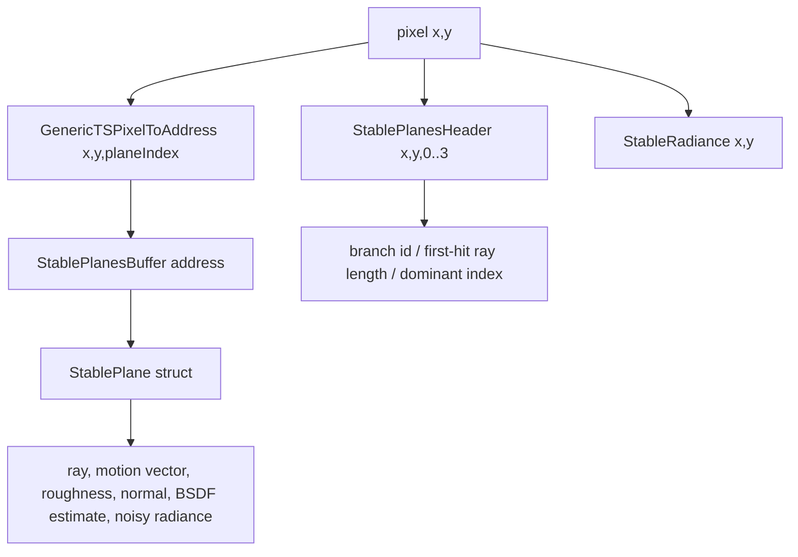

# StablePlane

## Overview
`StablePlane` 是 RTXPT 实时 stable planes 路径中写入 VRAM 的单个稳定路径层记录，用于保存某个像素某个 stable plane 的重建路径、运动向量、roughness、normal、BSDF estimate、branch metadata 和后续 fill pass 写回的 noisy radiance。`PathTracePrePass` 的 `dispatchRays` 完成后，stable planes 不是一个单一连续大对象，而是由 `StablePlanesHeader`、`StablePlanesBuffer` 和 `StableRadiance` 三类 GPU 资源共同描述。

## Responsibilities
- 保存每个像素每个 stable plane 的 ray origin / ray direction、path scene length、last ray distance、throughput、motion vector 和 denoiser guide 数据。
- 通过 `StablePlanesHeader` 存储每个 plane 的 branch id、first-hit ray length 和 dominant stable plane index。
- 使用 tiled swizzled addressing 将 `pixelPos + planeIndex` 映射到 `StablePlanesBuffer` 中的 `StablePlane` 元素地址。
- 区分有效 plane、空 plane 和排队等待探索的 split path payload；有效性主要由 `StablePlanesHeader` 的 branch id 判断。
- 为后续 `PATH_TRACER_MODE_FILL_STABLE_PLANES`、denoiser、debug visualization 和 radiance 合并提供稳定路径层数据。

## Involved Files & Symbols
- Rtxpt/Shaders/PathTracer/StablePlanes.hlsli - `StablePlane`, `StablePlanesContext`, `StoreStablePlane`, `StoreExplorationStart`, `StartPixel`, `StoreFirstHitRayLengthAndClearDominantToZero`, `StoreDominantIndex`
- Rtxpt/Shaders/PathTracer/Utils/Utils.hlsli - `GenericTSComputeLineStride`, `GenericTSComputePlaneStride`, `GenericTSComputeStorageElementCount`, `GenericTSPixelToAddress`
- Rtxpt/Shaders/PathTracer/Config.h - `cStablePlaneCount`, `cStablePlaneMaxVertexIndex`, stable plane constants
- Rtxpt/Shaders/Bindings/ShaderResourceBindings.hlsli - `u_StablePlanesHeader`, `u_StablePlanesBuffer`, `u_StableRadiance`
- Rtxpt/SampleCommon/RenderTargets.h - `RenderTargets::StablePlanesHeader`, `RenderTargets::StablePlanesBuffer`, `RenderTargets::StableRadiance`
- Rtxpt/SampleCommon/RenderTargets.cpp - GPU resource allocation for stable plane textures and buffer
- Rtxpt/Shaders/PathTracer/PathTracerStablePlanes.hlsli - hit/miss handling that writes stable plane data
- Rtxpt/Shaders/PathTracerSample.hlsl - build/fill stable planes raygen flow

## Architecture
`dispatchRays` 使用 `PATH_TRACER_MODE_BUILD_STABLE_PLANES` 变体完成后，stable planes 的 shader 可见资源布局是三部分：

```text
StablePlanesHeader : Texture2DArray<uint>, R32_UINT, size = W x H x 4
StablePlanesBuffer : RWStructuredBuffer<StablePlane>, element count = padded(W,H) x cStablePlaneCount
StableRadiance     : RWTexture2D<float4>, RGBA16_FLOAT, size = W x H
```

`cStablePlaneCount` 当前为 3，因此每个像素最多有 3 个 `StablePlane` 结构记录。`StablePlanesHeader` 额外使用第 4 个 array slice 保存 first-hit ray length 和 dominant plane index。



`StablePlanesHeader` 的逻辑布局：

```text
Header[x, y, 0] = stable plane 0 的 branch id
Header[x, y, 1] = stable plane 1 的 branch id
Header[x, y, 2] = stable plane 2 的 branch id
Header[x, y, 3] = first-hit ray length + dominant stable plane index
```

`Header[x, y, 3]` 的低 2 bit 存 dominant stable plane index，其余 bit 存 first-hit ray length 的 bit pattern：

```cpp
Header[x,y,3] & 0xFFFFFFFC  // first-hit ray length bits
Header[x,y,3] & 0x3         // dominant stable plane index
```

`StablePlanesBuffer` 是 plane-major 的 structured buffer，但每个 plane 内部不是简单 scanline，而是 8x8 tiled swizzled layout。当前启用 `TS_USE_MORTON = 1`，tile 内像素使用 Morton order。

```cpp
lineStride  = ceil(W / 8) * 8;
planeStride = lineStride * ceil(H / 8) * 8;

xInTile = x % 8;
yInTile = y % 8;
tilePixelIndex = Morton16BitEncode(xInTile, yInTile);

tileBaseX = x - xInTile;
tileBaseY = y - yInTile;

address =
    tileBaseX * 8
  + tileBaseY * lineStride
  + tilePixelIndex
  + planeIndex * planeStride;
```

因此同一个像素的三个 stable plane 逻辑上位于：

```text
StablePlanesBuffer[address(x, y, 0)]
StablePlanesBuffer[address(x, y, 1)]
StablePlanesBuffer[address(x, y, 2)]
```

每个 `StablePlane` 的字段顺序：

```cpp
float3 RayOrigin;
float  LastRayTCurrent;
float3 RayDir;
float  SceneLength;
uint3  PackedThpAndMVs;
uint   VertexIndexAndRoughness;
uint3  DenoiserPackedBSDFEstimate;
uint   PackedNormal;
uint2  PackedNoisyRadianceAndSpecAvg;
uint   FlagsAndVertexIndex;
uint   PackedCounters;
```

字段含义：
- `RayOrigin` / `RayDir`：稳定路径层重新追踪或继续路径时使用的 ray 数据；miss/sky 情况下 origin 可使用特殊值。
- `LastRayTCurrent`：最后一次命中的 ray distance。
- `SceneLength`：从相机沿 path 累计的总行进距离。
- `PackedThpAndMVs`：throughput 和 motion vector，以 FP16 packing 形式存储。
- `VertexIndexAndRoughness`：高 16 bit 存 vertex index，低 16 bit 存 FP16 roughness。
- `DenoiserPackedBSDFEstimate`：diffuse/specular BSDF estimate 的 FP16 packing。
- `PackedNormal`：oct encoding 后的 normal。
- `PackedNoisyRadianceAndSpecAvg`：后续 fill pass 累积 noisy radiance 和 specular average。
- `FlagsAndVertexIndex` / `PackedCounters`：用于必要时恢复或继续 path state。

`StableRadiance` 是独立 `RWTexture2D<float4>`。build pass 会在 `StartPixel` 中把每个像素清零，并把稳定的 emissive/environment radiance 累积到该纹理；noisy radiance 不写在这里，而是后续 fill pass 写入 `StablePlane::PackedNoisyRadianceAndSpecAvg`。

## Dependencies
- CPU allocation: `RenderTargets::Init` 创建 `StableRadiance`、`StablePlanesHeader` 和 `StablePlanesBuffer`，其中 `StablePlanesBuffer` 的大小依赖 `sizeof(StablePlane) * GenericTSComputeStorageElementCount(RenderSize.x, RenderSize.y, cStablePlaneCount)`。
- Shader binding contract: `u_StablePlanesHeader` 在 `u40`，`u_StablePlanesBuffer` 在 `u42`，`u_StableRadiance` 在 `u44`，必须与 `Sample::RecreateBindingSet` 和 `RenderTargets` 成员保持一致。
- Addressing contract: CPU 和 shader 都必须使用同一套 `GenericTS*` stride/address 计算；切换到 linear layout 需要同时重新编译 C++ 与 shader。
- Stable plane count contract: `cStablePlaneCount` 当前为 3，header 的 slice 0..2 与 buffer plane 0..2 对应，slice 3 另作 first-hit/dominant metadata。
- Path tracing modes: build mode 写 header/buffer/radiance 基础数据，fill mode 读取这些 plane 并回写 noisy radiance。

## Notes
- 判断一个 stable plane 是否有效，不应只看 `StablePlanesBuffer` 内容；应优先看 `StablePlanesHeader[x,y,planeIndex]` 的 branch id。
- `cStablePlaneInvalidBranchID = 0xFFFFFFFF` 表示空 plane；`cStablePlaneEnqueuedBranchID = 0xFFFFFFFE` 表示该 plane slot 暂存了等待探索的 split path payload。
- plane 0 默认是 dominant plane；如果其他 plane 被判定为 dominant，会通过 `StoreDominantIndex` 写入 `Header[x,y,3]` 的低 2 bit。
- `StablePlanesBuffer` plane 内部按 8x8 tile swizzle/Morton order 排列，直接按 `y * W + x` 读取会得到错误元素。
- `StablePlane::IsEmpty()` 通过 `VertexIndexAndRoughness >> 16 == 0` 判断结构体是否为空，但 pass 级有效性仍应以 header branch id 为主。
- `StablePlanesHeader` 是纹理资源，`StablePlanesBuffer` 是 structured buffer，`StableRadiance` 是普通 2D UAV texture；三者的生命周期由 `RenderTargets` 管理。
- 修改 `StablePlane` 字段会影响 payload packing、shader buffer stride、CPU 侧 `sizeof(StablePlane)` 和所有依赖 stable plane layout 的后续 pass。

## Callers (optional)
- `PathTracePrePass` / `PATH_TRACER_MODE_BUILD_STABLE_PLANES` 写入初始 stable plane layout。
- `PATH_TRACER_MODE_FILL_STABLE_PLANES` 读取 stable plane layout，并向 `PackedNoisyRadianceAndSpecAvg` 写入 noisy radiance。
- denoising、debug visualization、RTXDI surface data 相关流程会间接依赖 stable plane header/buffer/radiance 中的路径层数据。
