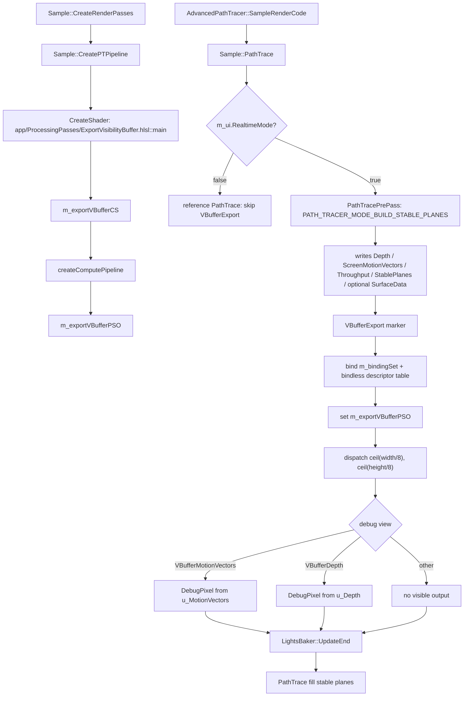

# VBufferExport

## Overview
`VBufferExport` 是 `Sample::PathTrace` 中实时 stable planes 路径专用的 GPU marker / compute pass，不是独立 C++ pass 类。当前 `ExportVisibilityBuffer.hlsl` 中原本从 stable planes 导出 VBuffer 的主体逻辑已被 `#if 0` 关闭，实时 VBuffer/denoising/RTXDI 所需的 depth、motion vectors、throughput 和可选 surface data 已转移到 `PATH_TRACER_MODE_BUILD_STABLE_PLANES` 的 `PathTracePrePass` 中生成；该 pass 现阶段主要保留 VBuffer depth / motion-vector debug visualization。

## Responsibilities
- 在 `Sample::CreatePTPipeline` 中创建 `ExportVisibilityBuffer.hlsl::main` compute shader，并保存为 `m_exportVBufferCS` / `m_exportVBufferPSO`。
- 在 `m_ui.RealtimeMode == true` 时，由 `Sample::PathTrace` 在 `PathTracePrePass` 之后、`LightsBaker::UpdateEnd` 与 fill stable planes path tracing 之前执行一次 2D compute dispatch。
- 使用主 path tracing binding set、bindless descriptor table 和 `SampleMiniConstants` push constants，与周边 RT/compute pass 共享同一套绑定契约。
- 当 debug view 选择 `DebugViewType::VBufferMotionVectors` 或 `DebugViewType::VBufferDepth` 时，将 `u_MotionVectors` / `u_Depth` 以可视化颜色写入 shader debug visualization texture。
- 保留一段禁用的历史实现，用于说明旧职责：从 dominant stable plane 解包 ray、scene length、throughput、motion vectors，并写入 depth / throughput / optional surface data；该职责目前不再由该 pass 执行。

## Involved Files & Symbols
- Rtxpt/Sample.cpp - `Sample::CreateRenderPasses`, `Sample::CreatePTPipeline`, `Sample::PathTrace`
- Rtxpt/Sample.h - `Sample::m_exportVBufferCS`, `Sample::m_exportVBufferPSO`
- Rtxpt/AdvancedSample.cpp - `AdvancedPathTracer::SampleRenderCode`, `AdvancedPathTracer::CreateRTPipelines`
- Rtxpt/ProcessingPasses/ExportVisibilityBuffer.hlsl - `main`
- Rtxpt/Shaders/Bindings/ShaderResourceBindings.hlsli - `u_MotionVectors`, `u_Depth`, `u_Throughput`, `u_StablePlanesHeader`, `u_StablePlanesBuffer`, `u_StableRadiance`
- Rtxpt/Shaders/PathTracerBridgeDonut.hlsli - `Bridge::ExportSurfaceInit`, `Bridge::ExportSurface`, `Bridge::ExportNonSurface`
- Rtxpt/Shaders/PathTracerSample.hlsl - `RAYGEN_ENTRY`, `FirstHitFromVBuffer`
- Rtxpt/Shaders/PathTracer/PathTracerDebug.hlsli - `DebugViewType::VBufferMotionVectors`, `DebugViewType::VBufferDepth`
- Rtxpt/SampleUI.cpp - debug view combo item strings for VBuffer debug views
- Rtxpt/SampleCommon/RenderTargets.cpp - `Depth`, `ScreenMotionVectors`, `Throughput`, stable-plane and surface-data resource allocation

## Architecture
`VBufferExport` 的 CPU 生命周期分两段：创建阶段由 `CreateRenderPasses -> CreatePTPipeline` 生成 compute PSO；帧内阶段由 `AdvancedPathTracer::SampleRenderCode -> Sample::PathTrace` 间接执行。它只在实时模式执行，reference mode 会跳过 stable planes pre-pass 和该 compute dispatch。

当前 shader 主流程很短：`main` 先用 `g_Const.ptConsts.imageWidth` / `imageHeight` 做 bounds check；随后跳过 `#if 0` 中的历史 VBuffer export 块；最后根据 `g_Const.debug.debugViewType`，将 motion vectors 或 depth 写入 `DebugPixel`。`DebugPixel` 最终写入 shader debug visualization UAV，而不是写入 path tracing 主输出。

`PathTracerSample.hlsl::FirstHitFromVBuffer` 名字中的 VBuffer 指的是 stable plane 0 / base plane 的重建输入。它在 fill stable planes mode 中从 `workingContext.StablePlanes` 读取 `StablePlane`，重建 path origin、dir、throughput、scene length 和 stable branch 状态；这些数据来自之前的 build stable planes ray dispatch，不是来自当前 live 的 `VBufferExport` compute shader。

## Dependencies
- 内部 CPU 系统：`Sample`、`AdvancedPathTracer`、`RenderTargets`、`ShaderDebug`、`PTPipelineBaker`、`LightsBaker`。
- GPU API / 框架：NVRHI compute pipeline、Donut `ShaderFactory`、主 path tracing binding layout 和 bindless descriptor table。
- 上游数据来源：`PathTracePrePass` / `PATH_TRACER_MODE_BUILD_STABLE_PLANES` 写入 `Depth`、`ScreenMotionVectors`、`Throughput`、`StablePlanesHeader`、`StablePlanesBuffer`、`StableRadiance` 和可选 `SurfaceDataBuffer`。
- 主要 shader 资源：`u_MotionVectors`、`u_Depth`、shader debug visualization texture；历史禁用块还引用 stable planes、throughput 和 RTXDI surface data。
- 配置常量：`NUM_COMPUTE_THREADS_PER_DIM == 8`，`PathTracerConstants::imageWidth/imageHeight`，`DebugConstants::debugViewType`。
- UI/debug contract：`PathTracerDebug.hlsli::DebugViewType` 枚举值必须与 `SampleUI.cpp` 的 debug view combo 字符串顺序保持一致。

## Notes
- `VBufferExport` 的命名具有历史遗留性：当前 live code 不再负责导出主要 VBuffer 数据；真正的数据导出在 build stable planes path tracing 阶段通过 `Bridge::ExportSurfaceInit`、`ExportSurface` 和 `ExportNonSurface` 完成。
- 该 pass 只在实时模式执行；reference mode 使用 `m_ptPipelineReference`，不会运行 `PathTracePrePass` 或 `VBufferExport`。
- `Sample::PathTrace` 在 `PathTracePrePass` 后显式将 `StablePlanesBuffer`、`Depth`、`ScreenMotionVectors` 和 `Throughput` 设为 `UnorderedAccess`；`VBufferExport` 自身没有额外 resource-state 设置。若未来扩展为 SRV 读取或新增写入目标，需要同步补充状态转换/排序点。
- `ExportVisibilityBuffer.hlsl` 仍 include `PathTracerBridgeDonut.hlsli`、`PathTracer.hlsli` 和 `RTXDI/SurfaceData.hlsli`，主要是为了历史禁用块；这些 include 会让该 compute shader 继续依赖 path tracing 的全局 binding/constant 契约。
- 如果重新启用 `#if 0` 中的导出逻辑，需要避免与 build stable planes pass 重复写 `Depth`、`Throughput`、`MotionVectors` 和 `SurfaceDataBuffer`，并重新审视 RTXDI、TAA/DLSS、denoising guides 的数据时序。
- CPU dispatch 尺寸来自当前 viewport，shader bounds check 来自 `g_Const.ptConsts.imageWidth/imageHeight`；修改 render-size / viewport 逻辑时应保持二者一致。
- `DebugPixel` 输出的是 debug visualization 纹理；如果 debug view 不是 `VBufferMotionVectors` 或 `VBufferDepth`，当前 live shader 对主渲染数据没有可见影响。

## Callers (optional)
- `Sample::CreateRenderPasses` 调用 `Sample::CreatePTPipeline` 创建 `m_exportVBufferPSO`。
- `AdvancedPathTracer::SampleRenderCode` 调用 `Sample::PathTrace`，后者在实时模式下执行 `VBufferExport` marker。
- `SampleUI.cpp` 的 debug view combo 可触发 `DebugViewType::VBufferMotionVectors` / `VBufferDepth`，使该 pass 写入 debug visualization。