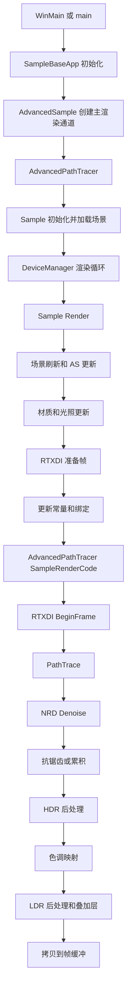

# RTXPT 渲染管线

## 概览
RTXPT 的渲染管线以 `Sample` 为主控类，以 `AdvancedPathTracer` 作为当前主样例的路径追踪专用实现。应用启动后由 `SampleBaseApp` 注册主渲染通道；每帧由 `Sample::Render` 组织场景刷新、AS 更新、材质/光照准备、路径追踪、RTXDI/NRD、抗锯齿、色调映射、后处理和最终拷贝到后备缓冲。

## 职责
- 创建并维护全局着色器绑定布局、bindless 描述符表、主常量缓冲、渲染目标、调试缓冲和着色器调试资源。
- 加载 `.scene.json` 场景，初始化相机、光源、环境贴图、样例设置、材质烘焙器、光照烘焙器、OMM 烘焙器和 RT/compute 管线烘焙器。
- 构建和更新光线追踪加速结构，包括场景网格 BLAS、蒙皮网格 BLAS、TLAS、子实例 GPU 数据和可选 opacity micromaps。
- 每帧更新相机、视图、抖动、路径追踪常量、材质 GPU 数据、子实例数据、环境光照、本地/解析/自发光光照和 RTXDI 资源。
- 调度路径追踪光线派发，包括参考模式、实时稳定平面构建/填充模式、VBuffer 导出、RTXDI DI/GI 通道、降噪引导烘焙和稳定平面调试可视化。
- 调度独立 NRD 降噪、TAA/DLSS/DLSS-RR 或累积通道，再执行 bloom、色调映射、色调映射后处理通道、着色器调试叠加层、缩放工具、调试线和最终后备缓冲拷贝。

## 涉及文件（不含行号）
- Rtxpt/AdvancedSample.cpp
- Rtxpt/Sample.h
- Rtxpt/Sample.cpp
- Rtxpt/SampleCommon/SampleBaseApp.cpp
- Rtxpt/SampleCommon/RenderTargets.h
- Rtxpt/SampleCommon/RenderTargets.cpp
- Rtxpt/SampleCommon/PTPipelineBaker.h
- Rtxpt/SampleCommon/PTPipelineBaker.cpp
- Rtxpt/Materials/MaterialsBaker.h
- Rtxpt/Materials/MaterialsBaker.cpp
- Rtxpt/Lighting/LightsBaker.h
- Rtxpt/Lighting/LightsBaker.cpp
- Rtxpt/RTXDI/RtxdiPass.h
- Rtxpt/RTXDI/RtxdiPass.cpp
- Rtxpt/ProcessingPasses/DenoisingGuidesBaker.h
- Rtxpt/ProcessingPasses/DenoisingGuidesBaker.cpp
- Rtxpt/Shaders/PathTracerSample.hlsl
- Rtxpt/Shaders/PathTracerMaterialSpecializations.hlsl
- Rtxpt/Shaders/PathTracer/Config.h
- Rtxpt/Shaders/PathTracer/PathTracer.hlsli
- Rtxpt/Shaders/PathTracer/PathTracerTypes.hlsli
- Rtxpt/Shaders/PathTracerBridgeDonut.hlsli

## 架构
`WinMain` / `main` 创建 `AdvancedSample`，调用 `Init`，随后进入 `RunMainLoop`。`SampleBaseApp::Init` 创建设备/窗口、着色器工厂，并通过 `CreateMainRenderPass` 创建主渲染通道，使用首选场景初始化该通道，然后将其注册到 Donut 的 `DeviceManager`。`AdvancedSample::CreateMainRenderPass` 返回 `AdvancedPathTracer`；它派生自 `Sample`，并重写 `SampleRenderCode`、`CreateRTPipelines`、`DestroyRTPipelines` 和 `GetMaterialSpecializationShader`。

`Sample::Render` 中的每帧 CPU 编排以资源有效性为核心顺序。它在渲染/显示尺寸变化时重建 `RenderTargets`，处理着色器重载和 NRD 模式变化，并在 `needNewPasses` 为 true 时初始化 `MaterialsBaker`、`PTPipelineBaker`、`ComputePipelineBaker`、`OmmBaker`、`ZoomTool` 和各类通道对象，随后调用 `RecreateAccelStructs`。`CreateRenderPasses` 会构造 `ShaderDebug`、可选 `RtxdiPass`、`AccumulationPass`、`ToneMappingPass`、`BloomPass`、`PostProcess`、`TemporalAntiAliasingPass`、环境与光照烘焙通道，以及 `DenoisingGuidesBaker`。

RT 管线设置分为变体声明和实际编译两步。`AdvancedPathTracer::CreateRTPipelines` 为 `PathTracerSample.hlsl` 创建 `PATH_TRACER_MODE_REFERENCE`、`PATH_TRACER_MODE_BUILD_STABLE_PLANES` 和 `PATH_TRACER_MODE_FILL_STABLE_PLANES` 变体，并额外创建仅 raygen 的 HDR 与边缘检测后处理变体。实际的着色器编译、hit group 特化、RT PSO 创建和 shader table 创建发生在 `PTPipelineBaker::Update` / `PTPipelineVariant::UpdateFinalize` 中。Hit group 按子实例从材质着色器排列组合推导得到，启用 alpha test 的材质会获得 any-hit 着色器。

加速结构由 `Sample` 负责持有和更新。`CreateBlases` 使用 `bvh::GetMeshBlasDesc` 为每个非蒙皮原型网格构建一个 BLAS；`CreateTlas` 创建 TLAS，并按每个网格实例的每个 geometry 分配 `SubInstanceData` 条目。每帧中，`UpdateSkinnedBLASs` 更新动画/蒙皮 BLAS，`BuildTLAS` 生成实例描述符并写入 OMM/调试/强制 opaque 标志，同时保持 `instanceContributionToHitGroupIndex` 与子实例顺序一致；`TransitionMeshBuffersToReadOnly` 将蒙皮顶点缓冲恢复为着色器可读状态。

光照在路径派发前准备。`UpdateLighting` 通过 `EnvMapBaker` 更新环境贴图状态，把方向光转换到环境贴图局部空间，并调用 `LightsBaker::UpdateBegin` 收集环境光、解析光和自发光三角形光源，构建光源采样代理，更新反馈历史，并上传光照控制缓冲。`PathTrace` 会在主光线派发前调用 `LightsBaker::UpdateEnd`，使本地/时间反馈缓冲准备就绪，供路径追踪器后续填充。

RTXDI 是可选路径，由 `m_ui.ActualUseRTXDIPasses()` 控制。`Sample::RtxdiSetupFrame` 填充 `RtxdiBridgeParameters` 并调用 `RtxdiPass::PrepareResources`，后者按需创建或调整 RTXDI 资源、prepare-lights 通道绑定和 RTXDI 管线。`AdvancedPathTracer::SampleRenderCode` 在 `PathTrace` 前调用 `RtxdiPass::BeginFrame`；在 `PathTrace` 内部，`RtxdiPass::Execute`、`ExecuteGI` 和可选 `ExecuteFusedDIGIFinal` 会在路径追踪派发准备好所需的 GBuffer/radiance 数据后执行 ReSTIR DI/GI。

着色器侧路径追踪从 `PathTracerSample.hlsl::RAYGEN_ENTRY` 进入。它初始化 `PathState`，通过 Donut bridge 计算主相机射线，从 `PathTracerBridgeDonut.hlsli` 获取 `PathTracer::WorkingContext`，运行 `PathTracer::StartPixel`，在 path 保持 active 时循环追踪下一次命中，最后调用 `PathTracer::CommitPixel`。`PathTracerMaterialSpecializations.hlsl` 提供 `CLOSESTHIT_ENTRY` 和 `ANYHIT_ENTRY`；closest-hit 调用 `PathTracer::HandleHit`，any-hit 通过 `Bridge::AlphaTest` 执行 alpha test，并可能忽略本次命中。

`PathTracer.hlsli` 包含核心 bounce 逻辑。`HandleHit` 更新已行进距离，通过 `Bridge::loadSurface` 加载表面与 BSDF 数据，处理嵌套介质和体积吸收，使用 MIS 累积自发光/解析光贡献，在实时模式中调用稳定平面处理，生成下一条 BSDF 散射射线，通过 `HandleNEE` 计算 NEE，在启用时应用 Russian roulette，并标记终止条件。`HandleMiss` 采样环境光照，计算相对于光源采样的 MIS，处理稳定平面 miss 导出，累积 radiance，并终止 path。

渲染目标流以 `RenderTargets` 为中心：路径追踪写入 HDR `OutputColor`，以及 depth、motion vectors、throughput、stable-plane、denoiser、ReSTIR GI、DLSS-RR、GBuffer 和调试目标。Denoising guides 会平滑 `SpecularHitT` 并计算平均层 radiance。独立 NRD 降噪准备 REBLUR/RELAX 输入，为每个 active stable plane 运行一个降噪器实例，并将输出合并回 `OutputColor`。实时后处理抗锯齿可使用 TAA、DLSS、DLSS-RR 或无降噪最终合并；参考模式使用 `AccumulationPass` 将 `OutputColor` 累积到 `ProcessedOutputColor`。

最终显示在路径追踪和降噪之后完成。`PostProcessPreToneMapping` 可选运行 bloom 和 HDR raygen 后处理，`ToneMappingPass::Render` 写入 `LdrColor`，`PostProcessPostToneMapping` 可选运行 LDR 边缘检测，然后绘制 shader debug、zoom 和 debug-line 叠加层，最后由 `CommonRenderPasses::BlitTexture` 将 `LdrColor` 拷贝到交换链帧缓冲。

## 依赖
- 内部场景/资源系统：`ExtendedScene`、`RenderTargets`、`MaterialsBaker`、`LightsBaker`、`EnvMapBaker`、`OmmBaker`、`PTPipelineBaker`、`ComputePipelineBaker`、`ShaderDebug`、`PostProcess`、`ToneMappingPass`、`BloomPass`、`TemporalAntiAliasingPass`、`AccumulationPass`、`NrdIntegration`、`RtxdiPass`。
- 外部/运行时库：Donut app/engine/render framework、NVRHI、DXR/Vulkan 光线追踪后端、RTXDI/ReSTIR、NRD、Streamline/DLSS/DLSS-RR/DLSS-G、NVAPI 着色器扩展、可选 ray tracing opacity micromap 支持。
- 配置/资源输入：`bin/Assets` 下的场景文件、材质目录下的 material JSON 数据、`LocalConfig`、命令行选项、`Rtxpt/Shaders` 下的 HLSL 源文件，以及 `SampleUIData` 中的运行时 UI 状态。
- CPU/GPU 契约：`SampleConstants`、`SampleMiniConstants`、`PathTracerConstants`、`SubInstanceData`、`PTMaterialData`、`Sample::Init` / `Sample::RecreateBindingSet` 中的着色器绑定槽位，以及 `Sample::FillPTPipelineGlobalMacros` 生成的着色器宏。

## 注意事项
- `Sample::RecreateBindingSet` 明确警告 binding set 必须匹配 `m_bindingLayout`；新增或移除着色器资源时，需要同步修改 CPU layout、binding set 和 HLSL 绑定。
- `PTPipelineBaker::Update` 会在全局宏、材质 hit group、源码时间戳或强制重载发生变化时重新编译变体。`CreateRTPipelines` 只声明变体；实际 RT PSO 和 shader table 创建会延迟到 update 阶段。
- 稳定平面在实时模式中启用。`PATH_TRACER_MODE_BUILD_STABLE_PLANES` 构建稳定/降噪平面，`PATH_TRACER_MODE_FILL_STABLE_PLANES` 针对这些平面追踪 noisy path，参考模式则绕过稳定平面并使用累积。
- AS 重建成本高且同步执行：`RecreateAccelStructs` 会等待 GPU idle，清空 binding/TLAS/mesh AS 状态，重建 BLAS/TLAS，执行命令列表，然后再次等待。材质变化、alpha/exclusion 标志或 UI 重建请求都可能触发此路径。
- 子实例顺序是 TLAS `instanceContributionToHitGroupIndex`、`m_subInstanceData`、`PTPipelineBaker` hit group 和着色器命中解码之间的共享契约。重排 mesh instance/geometry 时必须同时检查这些位置。
- 路径追踪器在 RT 管线中使用 `maxRecursionDepth = 1`，因为 path continuation 由 raygen 循环和 inline visibility/TraceRay 调用驱动，而不是递归光线追踪驱动。
- `RenderTargets::Init` 会按渲染分辨率和显示分辨率创建大量 UAV；DLSS 模式可能让 `m_renderSize` 不同于 `m_displaySize`，因此各通道必须使用正确的尺寸来源。
- `LightsBaker::UpdateBegin` 和 `UpdateEnd` 围绕路径追踪设置成对出现；后者会在后续 path dispatch 填充反馈纹理前，准备 feedback/local sampling 数据。
- 独立 NRD 降噪仅在 `m_ui.ActualUseStandaloneDenoiser()` 为 true 时执行。DLSS-RR 使用单独的 Streamline 资源标记流程，并在 `PostProcessAA` 中准备输入。
- Shader debug、debug feedback 回读、picking 和 debug lines 可能导致 GPU idle 或额外 copy；它们属于帧尾流程，会影响性能分析。

## 调用方（可选）
- `WinMain` / `main` 创建 `AdvancedSample`，调用 `Init`，随后调用 `RunMainLoop` 和 `End`。
- `SampleBaseApp::Init` 调用 `CreateMainRenderPass`，初始化返回的 `Sample`，并通过 `DeviceManager::AddRenderPassToBack` 注册它。
- `AdvancedSample::CreateMainRenderPass` 构造 `AdvancedPathTracer`，后者提供当前 active 的 `SampleRenderCode` 实现。